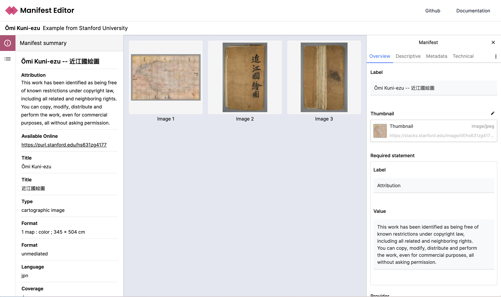
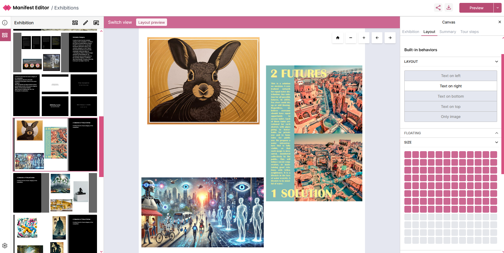
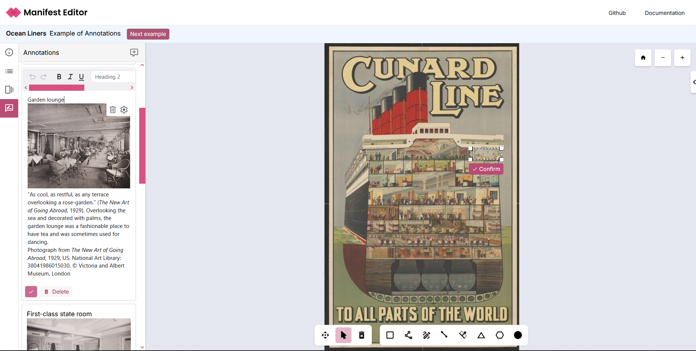

# Digirati IIIF Manifest Editor

An open-source, IIIF editing tool, the Manifest Editor is designed to provide a visually intuitive tool for creating, editing and updating IIIF Manifests and more. The Manifest Editor can be used as-is or can be further customised to support institute or organisation specific requirements.

## November 2025 - Latest release notes

### Creating and managing IIIF ranges (table of contents)

The latest release includes a new feature, the Range Editor workbench, developed in collaboration with CRKN. This workbench enables users to create or edit an existing range, and visually develop simple or complex range structure to present users with an accessible table of contents.

See the [Range Editor guide](https://manifest-editor-docs.netlify.app/docs/creating-ranges) for full details.

### Enhancements to Exhibition Editor tools

The Exhibition Editor, developed in collaboration with TU Delft earlier in 2025 has been updated to address user feedback captured in user testing and recent workshops. We’ve enabled a more realistic preview of your exhibition, provided more intuitive tour step creation and editing and added some further Exhibition Viewer modes.

See the section [Creating exhibitions using IIIF Manifests](https://manifest-editor-docs.netlify.app/docs/creating-annotations) for further information.

### Improved access to Annotation creation and editing

A new ‘Annotations’ toolbar link is now available when editing your IIIF content. It allows the Annotations functionality to be more visible, but more importantly provides an improved editing experience when creating and updating inline annotations.

See the section [Creating annotations](https://manifest-editor-docs.netlify.app/docs/creating-annotations) for further guidance.

## What is the Digirati IIIF Manifest Editor?

<<<<<<< HEAD
The Manifest Editor is an open-source web based editor, built from the ground up using IIIF, JS and HTML. You can use it to create new manifests, adding metadata, creating and managing canvases for simple and complex IIIF manifest requirements. You can preview your work in progress in a range of configured IIIF viewers, whilst you can share your work in progress or completed manifest with other users.
=======
The Manifest Editor is an open-source web based editor, built from the ground up using IIIF, JS and HTML. At its core it allows users to view IIIF manifests in an intuitive way, without the need to understand JSON, supporting learning and exploration of IIIF Manifests and how these are assembled by institutes and organisations to deliver rich, engaging only viewing experiences.

> > > > > > > feature/crkn-q3-2025-docs

You can use it to create new IIIF manifests, adding metadata, creating and managing canvases for simple and complex IIIF manifest requirements. You can preview your work in progress in a range of configured IIIF viewers, whilst you can share your work in progress or completed manifests with other users using the sharing options.

You can enhance manifests using the editor to add and edit annotations, create IIIF ranges (Table of Contents), change manifest behaviours and add geographic coordinates data (via navPlace) to support enriching your manifest with map-based interfaces.

You can also create IIIF Collections, adding metadata and selecting and adding existing IIIF Manifests to your collection.

The Manifest Editor provides an exhibition building workbench, enabling users to curate their IIIF Manifests for display as an exhibition or learning resource using the Exhibition Viewer.

## Standard Features

- Simple, intuitive user interface supporting comprehensive IIIF Manifest and IIIF Collection creation and editing
- Ability to browse and search existing IIIF content to select and edit items, or select or edit IIIF content directly from disk or via specific URL
- Support for curating complex, mixed content canvases enabling the assembly of multi-image or image and A/V content as needed
- Comprehensive support for creating and managing simple or complex IIIF ranges (table of contents)
- Ability to annotate IIIF resources
- Exhibition editing tools to support curating and enhancing IIIF content for story telling or exhibition display
- Extensible application enabling further customisation and configuration specific to institute or organisational use cases and workflows

## Audience

<<<<<<< HEAD
The current Manifest Editor reflects our experience gained in building content creation tools and custom viewing experiences, while user research has helped inform some of the core functional and usability improvements.

We have taken an approach to ensure the tool is more sustainable, both by continuing to build the tool using existing components (which are used by others in a range of scenarios) and by ensuring it is easier (and cheaper) for us and others to customise and adapt.

This means a separation of viewing/previewing from content creation for most scenarios. We have ended up with multiple versions of the Manifest Editor in the past, with different IIIF capabilities, user interfaces, and persistence mechanisms. Some versions integrate with our IIIF Cloud Services platform, allowing drag-and-drop creation of IIIF Image Services in real time.

We don't want to needlessly throw away the capabilities we have, but we want to maintain one editor going forward, that is simple and reliable to use, with excellent user experience. The needs of different adopters and users should be met by configuration, and choice of plugins, rather than different versions of the core editor.

=======
The Manifest Editor has been developed to support users creating and editing IIIF content; with a focus on usability to enable those wishing to learn or already familiar with the IIIF standard.

There are a whole range of use cases for visually editing IIIF Manifests; from within the context of museums, libraries, archives and their workflows to research and education.

The Manifest Editor can be used as is, or it can be further configured and customised to support specific requirements including integrating it into your workflows in ways that fit your organisational processes.

> > > > > > > feature/crkn-q3-2025-docs

## Background

In 2017 we started working on [IIIF Manifest-driven narratives](https://medium.com/digirati-ch/reaching-into-collections-to-tell-stories-3dc32a1772af) for the V&A, and in 2018 for [Delft University of Technology Library](https://drive.google.com/file/d/1ZRXJaOYNbOD0jsOF79maKhxl5re4-2Kt/view). These were based on the first iteration of our [Canvas Panel](https://iiif-canvas-panel.netlify.app/) component.

In 2018 we developed an experimental [IIIF Workbench](https://www.youtube.com/watch?v=HHQdQ8Ti5eI&t=12s) for assembling complex canvases in a visual environment (like PowerPoint).

These combined to make a [IIIF Manifest Editor](https://www.youtube.com/watch?v=D8oA3rHbvPM) that in normal, default mode produces IIIF Presentation 3 Manifests, but can be extended with plugins to produce IIIF Manifests with particular structures and custom `behavior` properties, to drive custom viewing experiences - slideshows, guided viewing and the complex digital exhibition layouts seen in the Delft examples. Development of branches of the Manifest Editor for different clients went hand in hand with new viewers and static site generators.

## Join the discussion

If you have a question or want to explore ideas with how the Manifest Editor can be extended or improved, you can contact us at Digirati (contact@digirati.com) or use GitHub discussions.

## Acknowledgements

The development of the IIIF Manifest Editor has been supported by:

- [Canadian Research Knowledge Network](https://www.crkn-rcdr.ca/en)
- [Delft University of Technology Library](https://www.tudelft.nl/library)
- [The National Gallery](https://www.nationalgallery.org.uk/), [Practical applications of IIIF](https://tanc-ahrc.github.io/IIIF-TNC/) project funded by [AHRC](https://ahrc.ukri.org/) as a [Foundation Project](https://www.nationalcollection.org.uk/Foundation-Projects) within the [Towards a National Collection](https://www.nationalcollection.org.uk/) programme. [Dec 2021 - Apr 2022]
- [Canadian Research Knowledge Network](https://www.crkn-rcdr.ca/en)

## Release Flow

Adapted from [azu/monorepo-github-releases](https://github.com/azu/monorepo-github-releases/tree/main) see instructions.
