# Range Editor

The Range Editor workbench enables users to create, edit and update IIIF Range items (most commonly Table of Contents) for use with a IIIF Manifest. The Range Editor supports the creation of a single IIIF Range, which can be labelled, edited and managed.

The IIIF Manifest should already contain the IIIF content (Canvases) you wish to include in your range, although you can continue to add to or edit your range as you update the Manifest. 

## Creating and managing a range example

In the following video, the IIIF Cookbook example for ["Table of Contents of Book Chapters"](https://iiif.io/api/cookbook/recipe/0024-book-4-toc/) is used to demonstrate how to add a table of contents (range), manage that range through the addition of additional range items, moving the content (canvases) to the correct range item to reflect the desired structure.

TODO: INSERT VIDEO.

## Accessing the Range Editor

Open the Manifest you wish to work in the Manifest Editor, then select the Range Editor link to access the workbench. This will allow you to add a range or edit an existing range. The following sections provide an overview of the functionality available.

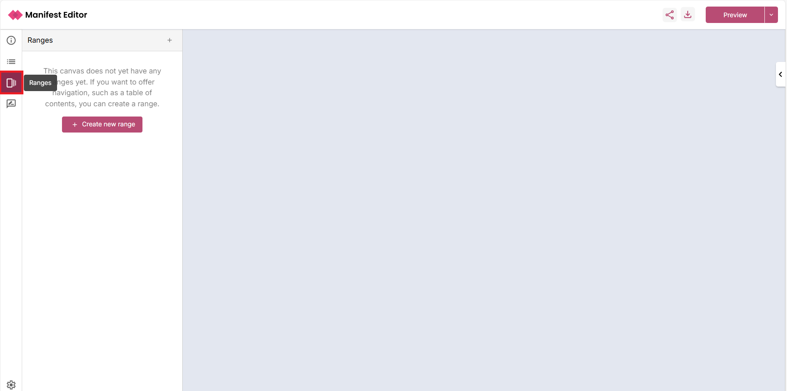

## Creating and editing a new IIIF Range

The Range Editor provides different routes to create a range reflecting the differing known use cases (to date). You can mix and match the routes to find the best approach for your own range editing workflow. 

Select the ‘Create new range’ link to add a new IIIF Range to your Manifest. On selecting to create your range, this will:

- Create a new IIIF Range labelled ‘Table of contents’
- Create a range item within the IIIF Range labelled ‘Range 1’, in which all Canvases in the Manifest will be placed

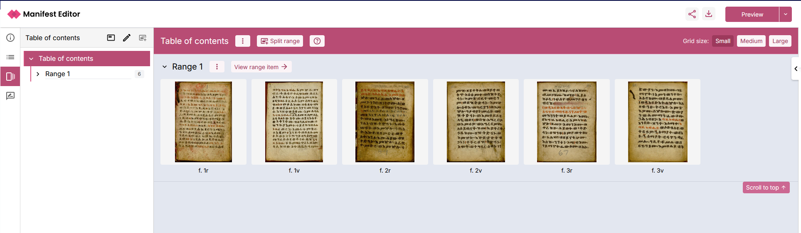

### Building your range structure

With the initial range in place, you can develop this structure to reflect the Table of Contents you want to use. You can add more range items into the structure, moving the content of your IIIF Manifest into these new range items and organising them as needed.

To start, select the option to 'Split range'. 

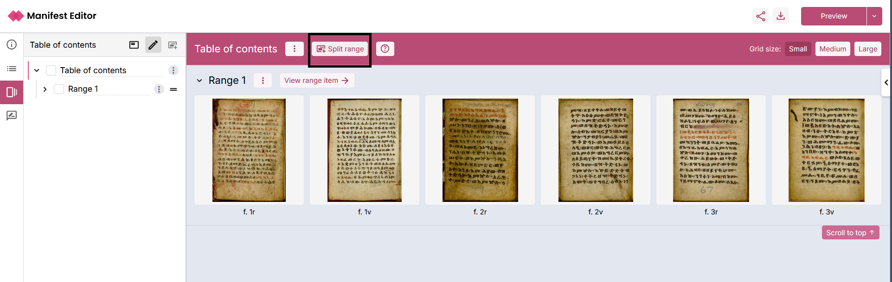

On selecting the 'Split range' option, the range splitting mode is enabled providing you with the ability to split the content into the required range items. 

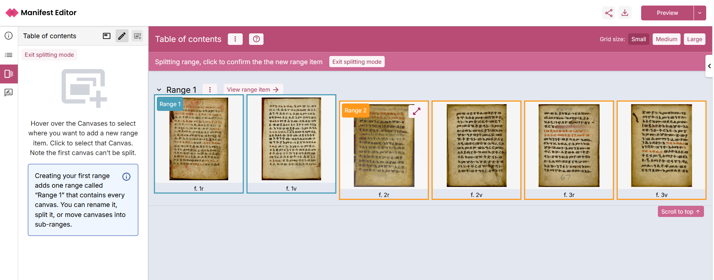

To split the contents of 'Range 1' into one or more range items:

- Identify the Canvas where you want to create a new range
- Hover over that Canvas thumbnail, which will highlight "Range 2" and the contents that will be included in the new range
- Click on the Canvas thumbnail, to create the new range ("Range 2")
- The new range item will be listed, with the content of that range reflecting the selection

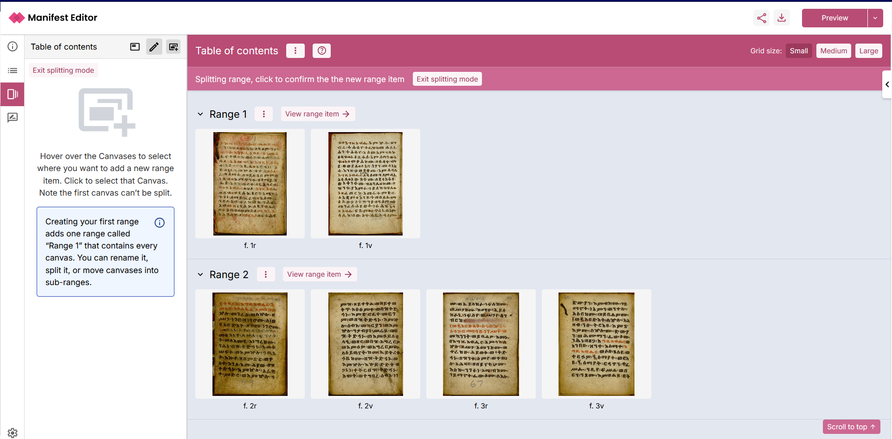

- Select the 'Exit splitting mode' link to close the range splitting view.

Range items can contain other range items, perhaps to reflect the structure within a chapter of a book or the structure of a collection. 

To nest range items within an existing range item, you simply move the Canvas content from that range into a new sub-range, where you can then manage that content further using the 'Split range' option to create additional range items at that level.

Using 'Range 2' example indicated in the previous screenshot, the following steps detail how to move all of the canvases contained within that 'Range 2' item into two new sub-range items:

- Select the ‘View range item’ option for Range 2

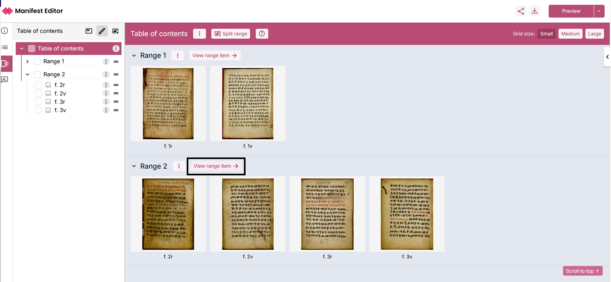

- Within the Range 2 view, all of the Canvases contained in that range item are displayed. Select the option to 'Move into new sub-range'. 

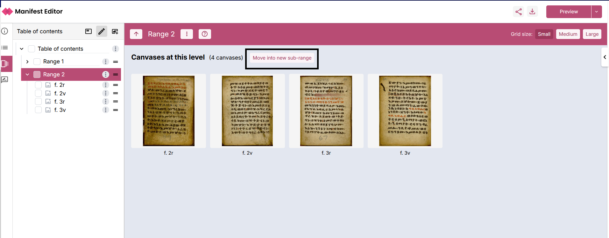

- This action moves the Canvases into a new sub-range item ("Range 1") within Range 2. 

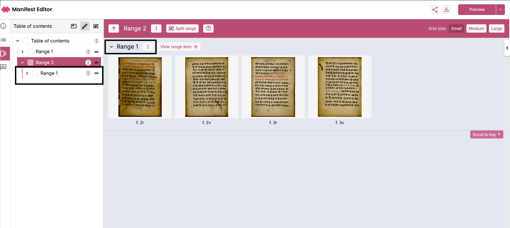

- You can then use the 'Split range' option to manage the content further.
- In the example below, the Canvases have been split further, moving two canvases into a second sub-range "Range 2"

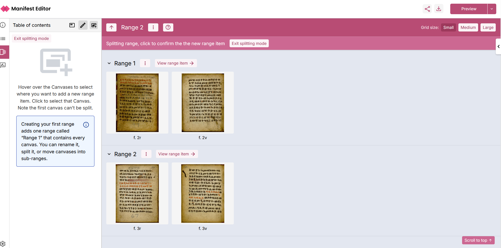

You can continue to repeat this process of creating new range items as required, to develop the necessary hierarchy to support the navigation structure you want to provide to users interacting with your IIIF Manifest.

The workbench view provides additional range management options to support moving content between range items as required. The 'three dot menu' for each range item includes the options:

- (a) Empty contents of a range item into another range item. This option moves all canvases from that range item into the selected range, leaving an empty range item.
- (b) Merge a range item and its content into another range item. This option moves all canvases from that range into the selected range, deleting the range item.

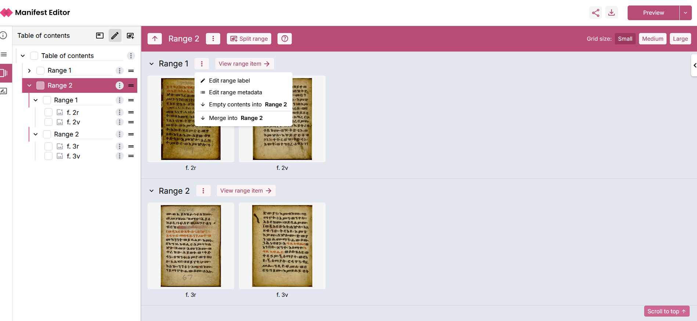

### Editing range item labels

Using the 'three dot menu' you can select to 'Edit range label', to update the range item labels to the appropriate value for your range:

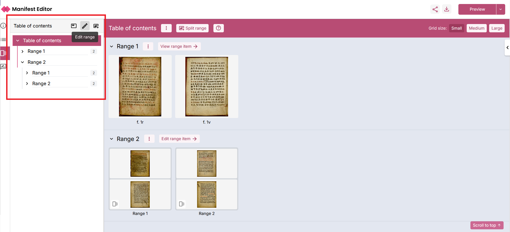

### Viewing and managing the range structure

The left menu panel for the Range Editor provides a number of options when editing a range. A simple, card view is available enabling display and navigation of the range structure. By default, the left menu panel displays the hierarchical range structure (tree view). This enables you to view and navigate through the full structure of your range. Clicking on the range items within the navigation tree structure will display the selected range item in the centre workbench.
 
### Edit range structure

Select the 'Edit range' option in the left menu panel to edit and update the range structure.

Once selected, you can then edit the range structure using the additional options. The 'three dot menu' link, provides contextual options relevant to the Range, range item or canvas you are viewing.  

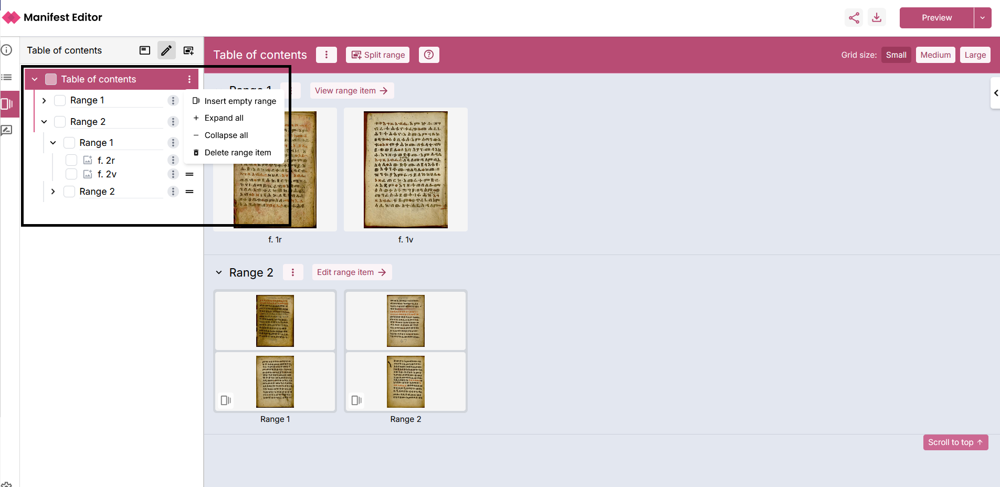

- Insert empty range - allows the creation of range items within the structure into which canvases can be moved
- Expand all - opens the range structure
- Collapse all - closes the range structure
- Delete range item - allows the removal of a range item.

#### Reorder the range content

In the 'Edit range' structure, you can use the 'drag handle' (= icon) next to each element in the tree view hierarchical range structure, to select and move the content. This supports quickly moving canvases between range items, changing the order of range items and moving range items into other range items.

#### Deleting range and range items

The 'Delete range item' available within the 'three dot menu' for the IIIF range allows the deletion of the entire range. Similarly, the 'Delete range item' can be used for removing range items from the range structure.

When a range item, containing one or more canvases is deleted from the range structure, the orphaned canvases are added to a separate (non visible) range item labelled 'Canvases without a range'. In the screenshot below, you can see two canvases listed in this range item. These canvases can be moved elsewhere within the range structure (if required).

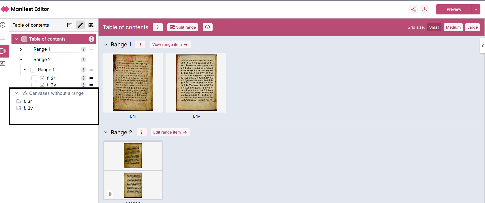

#### Deleting canvases from the range

Similar to the delete range option, each canvas can be individually removed from the range structure. Use the 'three dot menu' for the specific canvas and select the 'Remove canvas' option. This will result in that canvas being added to the separate (non visible) range item ('Canvases without a range').

### Viewing Canvases in the Range Editor

The Range Editor workbench provides an option to enable users to view a Canvas in detail whilst working on a range. Use the “Expand Canvas” option on the individual canvas to open a detailed view, which supports deep zoom whilst working on the range.

You can then navigate between Canvases in the current range item, using the available controls as indicated in the screenshot below. Additionally you can edit and update the Range item label whilst using this view.

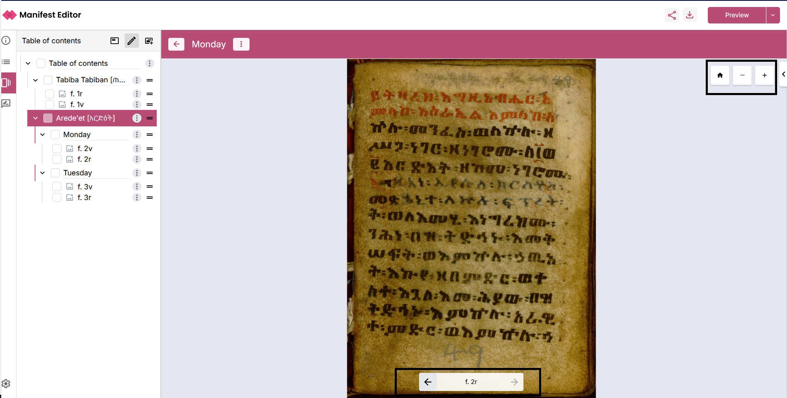

### Tour of Range Editing functionality

The Range Editor workbench has a small, guided tour available that highlights the key aspects of the functionality available. Select the 'Help' icon at the top of the centre panel to recall the tour at any time.

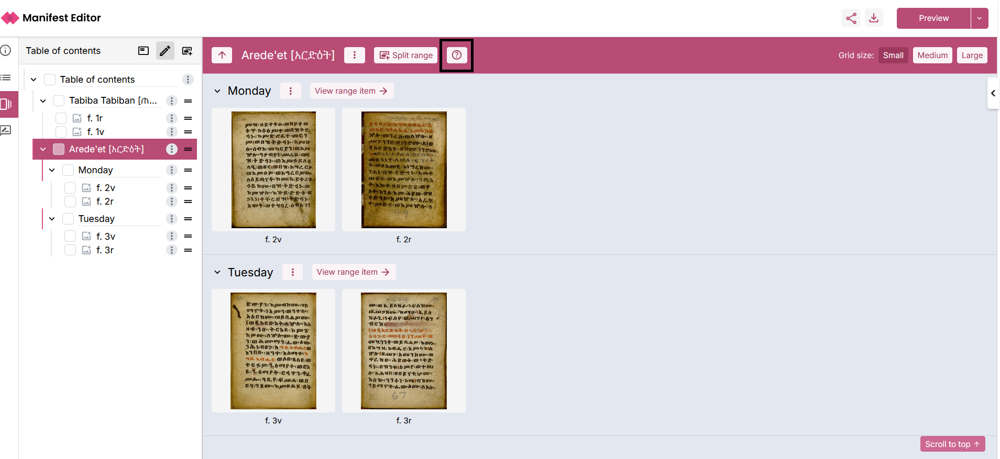

## Notes on implementation

Changes in your Manifest are not automatically reflected in the range, so you do need to keep the range updated should the Manifest change significantly in structure (for example if you add new Canvas(es)). Ideally ranges should be added when the Manifest structure is confirmed; however, you can always delete the range and create a new one, should the Manifest structure need to be revised after you’ve added a range.

The implementation has developed support for https://iiif.io/api/presentation/3.0/#54-range with some minor, but notable caveats:

- In developing and testing the implementation we have encountered many varied interpretations of the IIIF Range specification. The Range Editor doesn’t attempt to “fix” inconsistencies, these can be addressed by removing the range and creating a new one.

- Parts of Canvases are not yet supported by the Range Editor. That is, it is not possible to add a “part of a canvas” as a target within a Range Item. Given the lack of widespread viewer support, this feature has not been added. In future, with better IIIF Viewer support, an approach to accommodate this can be addressed.

- A single IIIF Range per Manifest is currently only supported. Given examples of use case(s) with multiple ranges, we can assess how best to accommodate supporting multiple IIIF Range(s) should they be required.
