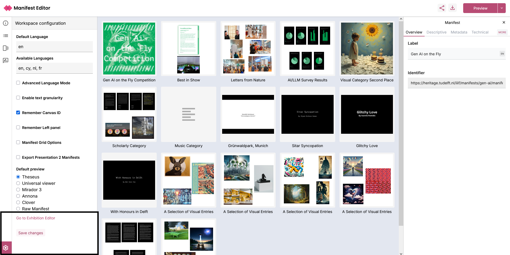
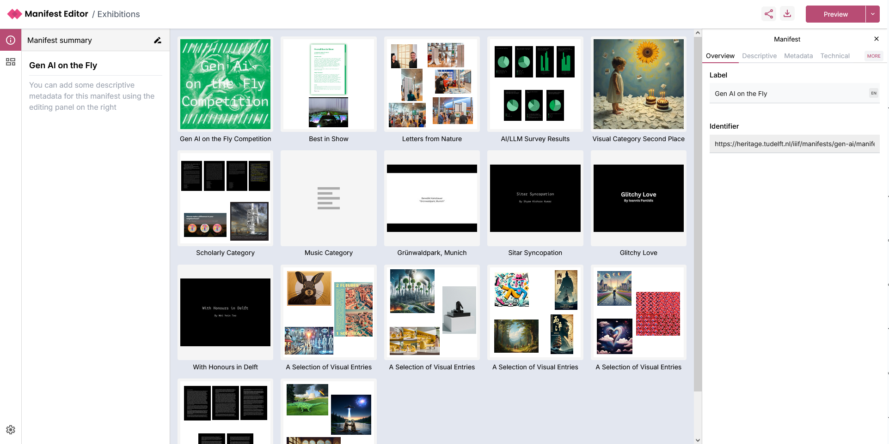
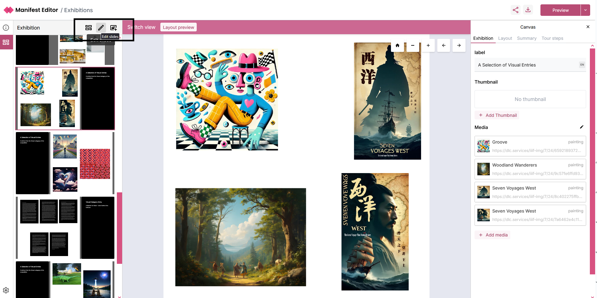
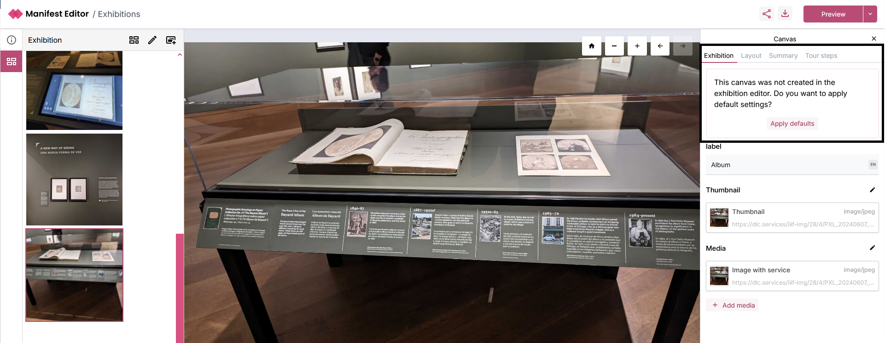
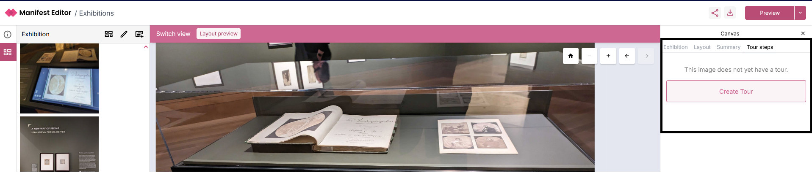

# Creating exhibits or storytelling using IIIF Manifests

The Manifest Editor supports the creation and development of IIIF content for storytelling or exhibition style presentations. 

## Accessing the Exhibition editor

The Exhibition editor is a separate workbench view within the Manifest Editor, to allow users to create and curate their Manifests for presentation. The tools provided are more focussed to allow access to the necessary layout and behaviour properties to support the presentation of the content. Easy access to annotate your IIIF content, supporting your storytelling displays is also provided in this view.

You can start working on a IIIF Manifest for an exhibition either by:

a. Selecting the 'Create Exhibition' option on the Manifest Editor homepage. This will create a new, empty IIIF Manifest in which you can curate your content.
b. Open an existing IIIF Manifest, and navigate to the Exhibition Editor via:
- Select the 'Settings cog' in the bottom left hand menu - see screenshot below. This opens the Workspace configuration for the Manifest Editor.
- Select the link 'Go to Exhibition Editor', which will open your Manifest in the Exhibition Editor

## Introduction to the Exhibition editing mode

Your Manifest will open in the Exhibition Viewer as indicated in the screenshot below. The layout and structure is similar to the standard Manifest Editor workbench view. The Manifest and it's Metadata properties are presented in the same way.

The main difference is how you interact with the Canvases in your Manifest, in this view.

The left hand panel allows interaction with the individual “slides” (aka Canvases) that make up the exhibition. These are simply the canvases which are present in the IIIF Manifest you are editing.

The centre grid view presents the contents of the IIIF Manifest, whilst the right hand panel presents the Manifest metadata.

## Editing the exhibition

Clicking the Exhibition Grid icon on the left navigation, opens the Exhibition grid view where you can see an outline of your exhibition.

There are a number of controls:

- 'Grid view' which enables you to view the exhibition as a grid, essentially providing a "Preview" of the exhibition you are creating.
- 'List view' you can toggle the 'Grid view' to display the slides in the exhibition as a list.
- 'Edit slides' allows you to reorganise and update the order of the "slides" (aka Canvases) within the manifest. You can also remove "slides" from the manifest using the three dot menu.
- 'Add a new slide' enables you to add IIIF content on a new slide (aka Canvas) to your exhibition manifest.

When you click on a slide in the left hand panel (or via the centre grid view), the right hand panel presents additional exhibition specific metadata options for each slide.

## Editing and updating your Exhibition manifest

When you select a slide (canvas), the right hand side metadata panel presents the 'Exhibition' tab. If the canvas was not added in the Exhibition Editor, an option to ‘Apply defaults’ which allows you to quickly select some basic layout options for the canvas will be available:

Selecting to apply these defaults will determine aspects of the layout and behaviour of the exhibition manifest when viewed in the standalone Exhibition Viewer. These defaults can be changed after application.

When you navigate to the ‘Layout’ tab, you’ll notice what has been applied:

### Aspect ratio

This will indicate a warning if applicable. You can use the ‘Size’ option to adjust the image appropriately and assess how well your changes apply to your selected content.

As you alter the size, you’ll see how the changes impact the exhibition layout in the left hand exhibition grid.

### Behaviours

There are a number of layout behaviours that determine how to present the slide (Canvas) Summary information, when viewing the exhibition manifest in the standalone Exhibition Viewer. The following options are available which can be applied to your slides:

- Text on left
- Text on right
- Text on bottom
- Only image

### Floating (behaviour)

The Exhibition Viewer supports "floating" tours, where any tour step information is presented as a floating modal. This value defaults to 'None', but you can edit and change this for your slides if required. The following options are available:

- None
- Floating top left
- Floating top right
- Floating bottom left
- Floating bottom right

## Summary

The 'Summary' tab presents the existing (Canvas) Label and Summary values if added for the current slide. This information can be presented as part of the exhibition, using the behaviour controls mentioned in the previous section.

These values can be edited and updated as needed.

## Creating a Tour of your Exhibition manifest

The 'Tour steps' tab allows further configuration of the interaction provided for each individual slide, when viewed in the [Exhibition Viewer](https://exhibitionviewer.org/).

Each tour step that is created is saved as an annotation, and these annotations can be viewed in other IIIF enabled viewers (which support display of annotation).

To add Tour steps to your slide, you select the option 'Create Tour'. This will create an initial tour (which is an Annotation Page), into which you can create one or more tour steps.

## Previewing your Exhibition manifest

As you work on your IIIF Manifest, you can preview how your changes will be displayed using the current list of supported Exhibition Viewer options. These include:

- Delft exhibition (TU Delft specific exhibition view - which presents the exhibition as a scrollable page)
- Delft slideshow (TU Delft specific exhibition slideshow which allows the exhibition to be "played" supporting exhibition display for example)
- Light exhibition (generic, lightly themed exhibition view - presenting the exhibition as a scrollable page)
- Light slideshow (generic, lightly themed exhibition slideshow - allows the exhibition to be "played")
- Floating tour (generic, lightly themed exhibition slideshow, presenting the tour step(s) (annotations) as a floating modal that can have it's position configured) 

