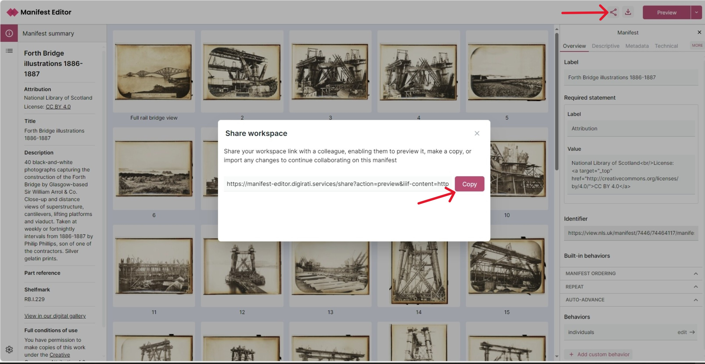

# Managing Workspaces

When you open a Manifest from a URL or a file, or when you create a new Manifest it will be saved in your browser's local storage. This is called a workspace. You can have multiple workspaces and switch between them. Changes will be saved automatically.

You can see all your workspaces on the homepage. You can also delete workspaces from the list using the 3 dots menu.

<video
  src="/workspace.mp4"
  autoPlay
  loop
  muted
  controls
  playsInline
  style={{ margin: "3em 0" }}
/>

## Sharing workspaces

If you want to share your work with someone else, you can use the share feature. This will generate a URL that you can send to someone else.

The person with whom you share the URL, can open the link, which should load the Manifest Editor. They should then see a "preview" of your workspace, enabling them to view your work in progress or completed manifest, without the ability for that user to change your source workspace.

The person may decide to apply some changes, albeit to their own workspace. They can select to make a copy and then edit the manifest as appropriate. They can then share their changes with you by generating a new share URL.

