# IIIF Browser - Discover and Reuse existing IIIF content

The IIIF Browser lets you explore published IIIF Collections and Manifests. You can search, navigate, and import content directly into your Manifests. This helps you build on existing resources — for example, by reusing canvases or cropping images from other IIIF sources.

## Using the IIIF Browser to open IIIF content

The IIIF Browser is available as an option on the Manifest Editor homepage, allowing users to select and open existing IIIF content. You can also select this option when you are editing and adding content to your Manifest.

### Opening the IIIF Browser

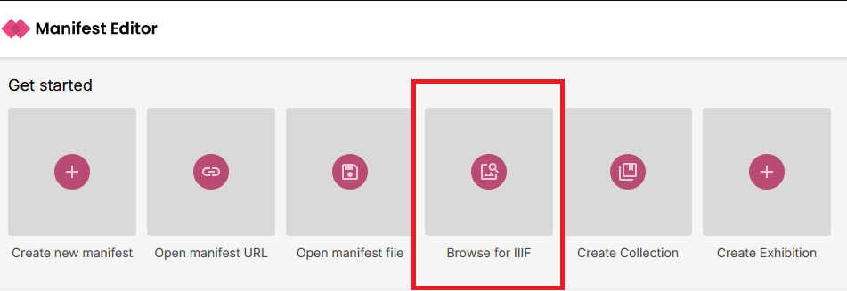

1. On the Manifest Editor homepage, click “Browse for IIIF”.
2. The IIIF Browser will open in its default view.
3. If it’s your first time, the browser may be empty. Your previously visited URLs will be saved in your browser storage, making repeat access faster.

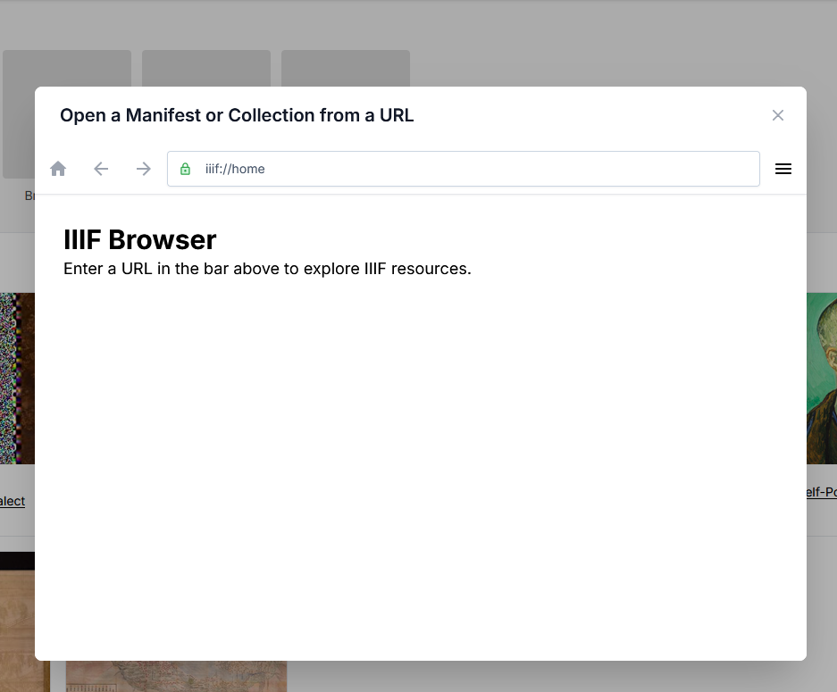

To start, select the URL of the IIIF content you wish to browse (this might be a IIIF Collection or a IIIF Manifest). Paste the URL into the browser URL bar as indicated in the screenshot below:

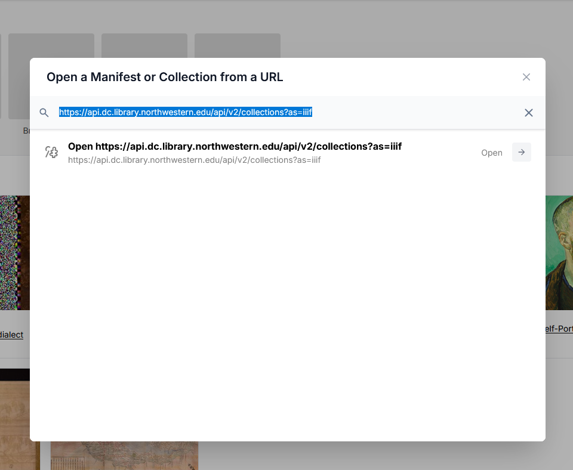

Click to open (or press return), and the browser will open the IIIF content.

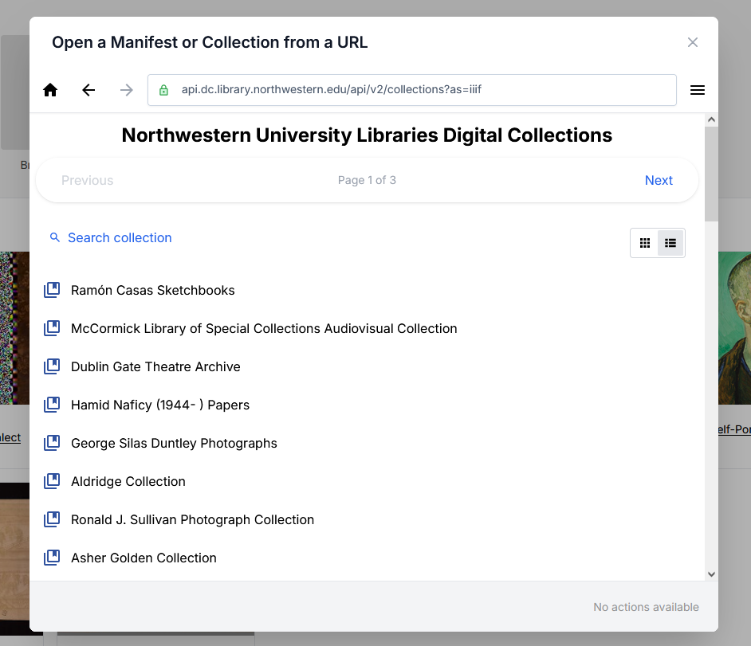

### Browsing the IIIF content

Once you have selected and opened IIIF content, the IIIF Browser provides options to navigate and search the available content.

- The browser displays items in list view by default, but you can switch to grid view to see thumbnails.
- Use the navigation arrows or pagination to move through the collection.
- Click any item (collection or manifest) to explore into its contents.

In the screenshot below, selecting the Collection 'Dublin Gate Theatre Archive' opens that collection, enabling you to browse the contents.

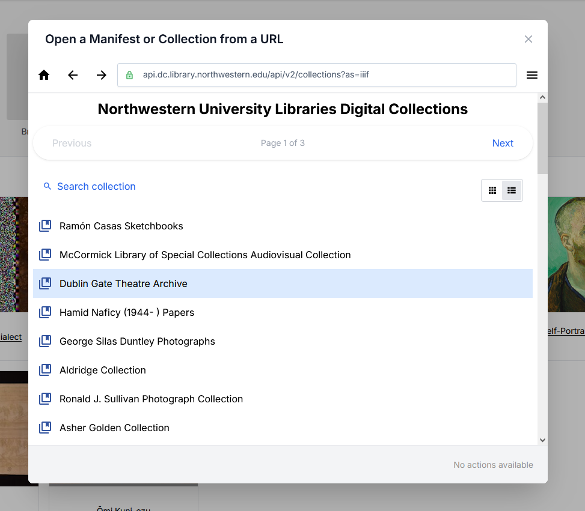

### Searching the IIIF content

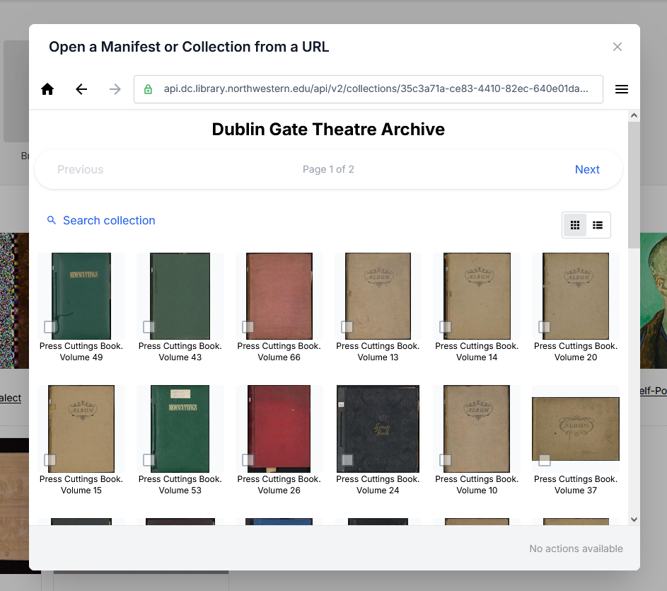

- Use the "Search Collection" option to help find the appropriate content.
- This search uses the IIIF content labels to provide a basic search across the currently loaded collection, so make sure you are in the right context.

In the screenshot below, entering the term 'volume 12' filters and identifies the most appropriate IIIF content matching that term in the selected collection.

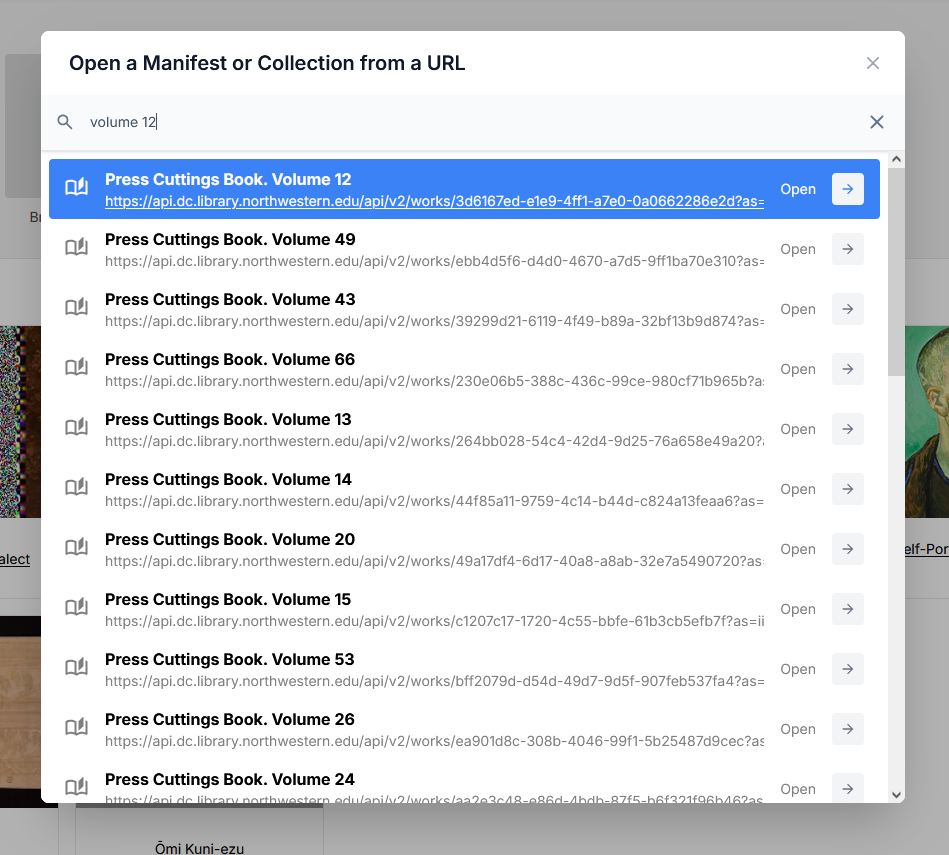

### Opening the IIIF content

To reuse existing IIIF content, click “Open in Manifest Editor” on the item you want.

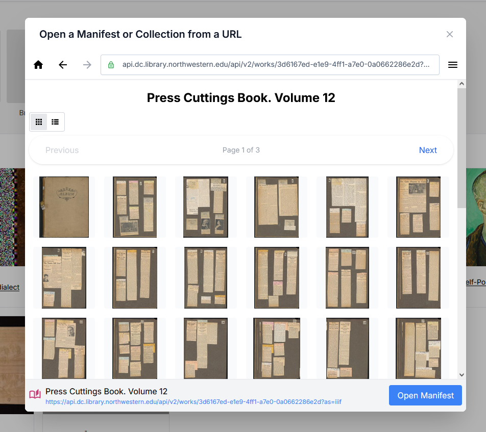

This will load the selected Manifest for you to begin working with your copy of it.

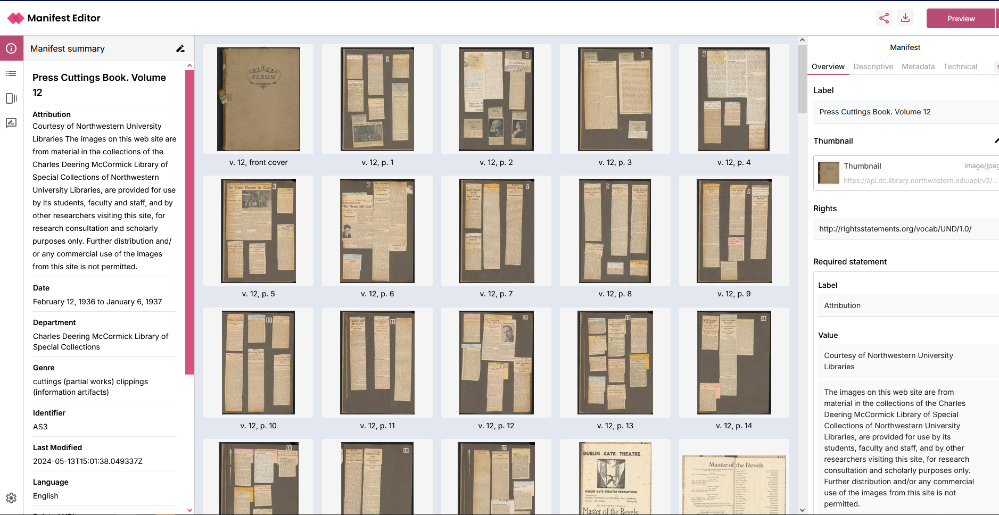

## Using the IIIF Browser to add content to your manifest

The IIIF Browser enables you to discover, preview, and reuse content from existing IIIF resources when building a Manifest. Rather than creating every canvas from scratch, you can browse published IIIF Manifests and Collections and selectively include some of that content into your manifest.

### When to Use the IIIF Browser

Use the IIIF Browser when you want to:
- Reuse content from an existing IIIF Manifest or Collection.
- Include content published by another institution or repository.
- Select individual canvases from an existing Manifest.
- Reuse a specific region of an image by creating a crop.
- Build new narratives or exhibitions using existing IIIF resources.

### Opening the IIIF Browser
- Open your Manifest in the Manifest Editor.
- Navigate to the Canvases in the left hand menu and select the IIIF Browser link
- Alternatively, using the 'Add new canvas' you can select the IIIF Browser option from the Add content menu

### Finding IIIF Content
- Paste the URL of a IIIF Manifest or Collection into the browser.
- The Manifest or Collection will be displayed as an available resource.
- Select Open to browse its contents.

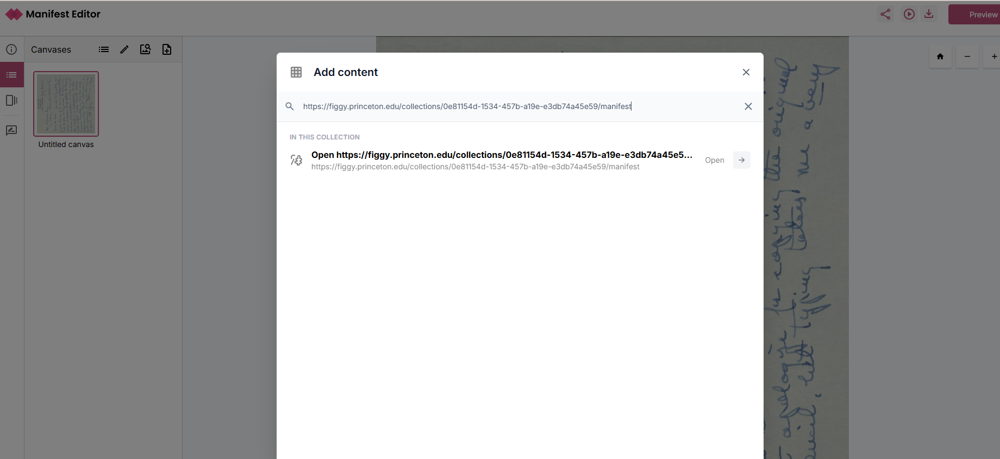

### Browsing Canvases
Once a Manifest or Collection has been opened:
- Review the list of available manifests or canvases.
- Navigate through the list to find the item you wish to open and view.
- Select a canvas thumbnail to preview the content.

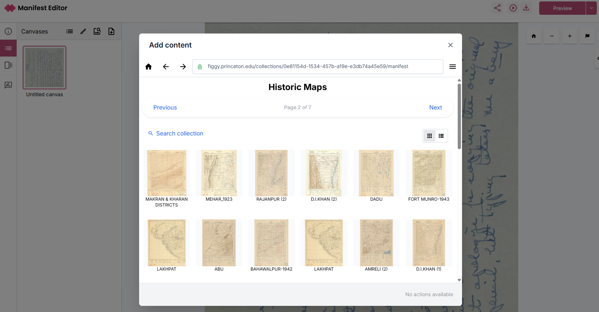

### Selecting Content
When viewing a canvas:

- Review the content in the preview window.
- If required, use the available image tools to define a cropped region of the image or to rotate the image.
- Use the Select option to add your selection to your Manifest as a new canvas.

Note: Not all IIIF viewers support image cropping. If you use a cropped region, verify that your target viewer supports the feature.

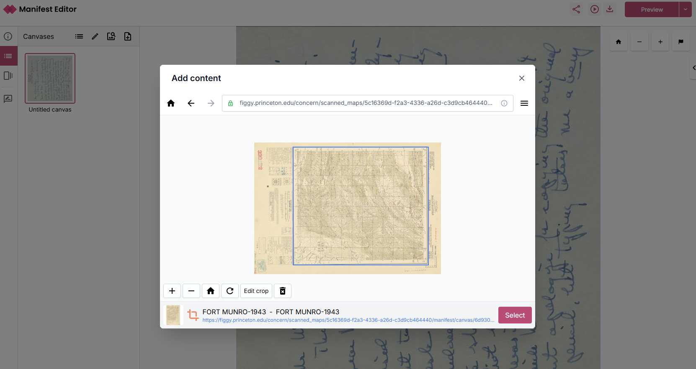

### Metadata Preservation
When content is added through the IIIF Browser:

- Metadata from the source resource is retained.
- Rights statements and required attribution statements are carried across with the selected content where available.
- The originating Manifest can be referenced through the IIIF metadata structure, supporting provenance and citation of reused material.

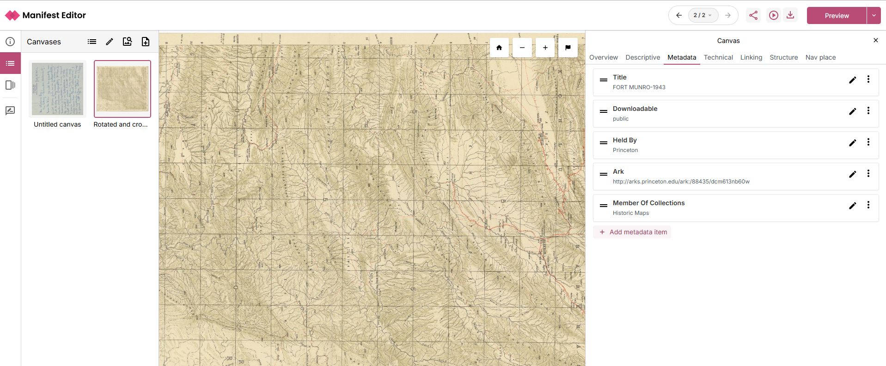
