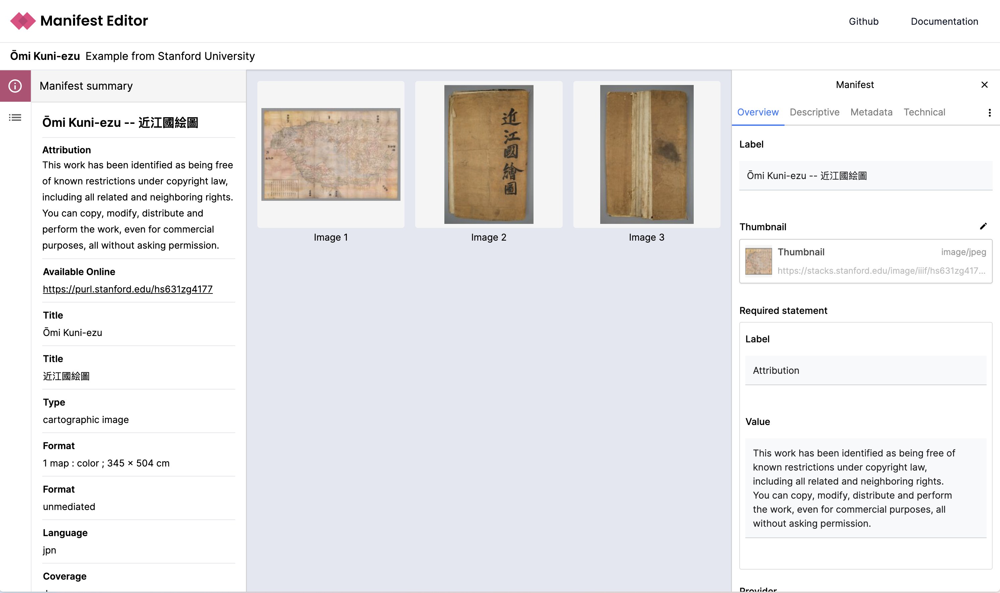
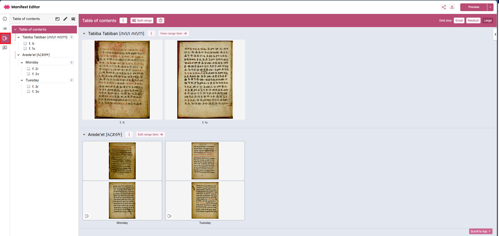
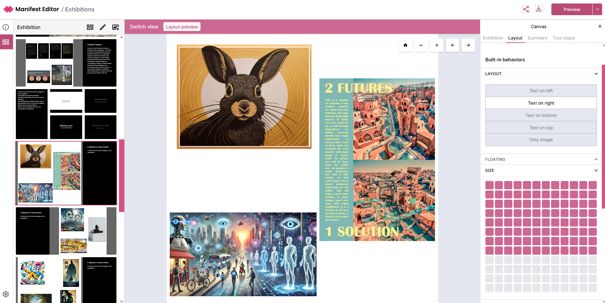
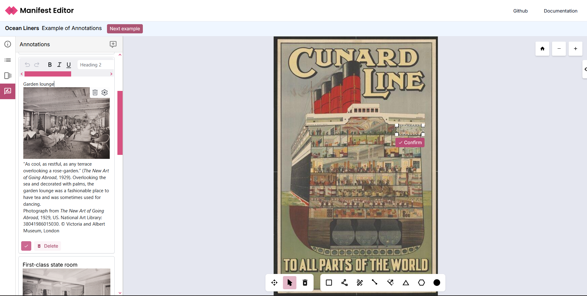

# Digirati IIIF Manifest Editor

An open-source, IIIF editing tool, the Manifest Editor is designed to provide a visually intuitive tool for creating, editing and updating IIIF Manifests and more. The Manifest Editor can be used as-is or can be further customised to support institute or organisation specific requirements.

- [Access the latest version](https://manifest-editor.digirati.services/)

## **Manifest Editor – June 2026 \- New Features & Improvements**

The latest Manifest Editor release introduces significant enhancements to manifest editing workflows, expanded viewer support, and a new plugin system that enables advanced extensibility for including or excluding additional editing features.

---

### **Manifest Editing Tools**

#### **Canvas Flags**

You can now apply **flags to individual canvases** to support review and editorial workflows. Flags help users identify canvases that require attention, enabling structured review and quality control. From the grid view you can use the filter to view all or only the flagged canvases within your manifest.

#### **IIIF Choice Support (Create & Edit)**

Improved support for **IIIF `Choice` resources** allows you to easily create and manage canvases with multiple representations (e.g. visible light, infrared).

This simplifies editorial workflows for:

* Multi-spectral imaging
* Alternate renderings
* Comparative viewing scenarios

#### **Metadata Editing Improvements**

The metadata editor has been redesigned to provide clearer and more efficient editing of labels and values for metadata properties. This update improves usability for both bulk editing and detailed metadata work.

**Global Canvas Navigation**

A new **global navigation component** enables improved movement between canvases within the editorial workflow.

#### **Expanded Viewer Preview Options**

Additional IIIF viewer integrations are now available for previewing content, these include:

* **TIFY**
* **Triiiceratops**
* **Glycerine**

This provides greater flexibility when validating how manifests render across different viewers.

---

### **Workflow & Extensibility**

#### **Plugin System (New)**

A new **plugin system** has been introduced to support extensibility and custom workflows.

This enables the ability to tailor functionality for specific use cases, and supports new custom plugin creation.

Many new capabilities are now available as **beta features**, disabled by default and configurable as needed. New “background actions API” provides the support to support scheduling and running longer running tasks.

### **Beta Features (Optional Plugins)**

#### **A/V Ranges**

Create and manage **temporal ranges for audio-visual content**, supporting time-based navigation and segmentation.

#### **Canvas Label Generator**

Bulk create or update canvas labels using configurable rules, which can:

* Apply to all canvases
* Or only canvases without existing labels

This can be used to support manifest preparation including normalisation or clean up of labels.

#### **Translations**

Automatically generate translations of labels within a manifest.

* Select target language(s)
* Apply translations to selected labels

This feature uses the **M2M100 translation model**.

#### **OCR Classification (Beta)**

Run an **in-browser classification model** to assess OCR complexity for each canvas.

Canvases are tagged as:

* Easy
* Medium
* Difficult

This supports:

* OCR strategy planning
* Selection of appropriate transcription models

Works in conjunction with upcoming **Remote Inference capabilities**.

#### **Local OCR**

Generate OCR directly in the browser using a lightweight local model.

* Produces transcriptions for manifest content
* Applies results as annotations on canvases
* Currently uses: `onnx-community/granite-docling-258M-ONNX`

---

### **Remote Inference (Trial)**

We are currently running a **trial with partner institutions** to validate our beta Remote Inference pipeline.

This enables:

* Routing content to appropriate OCR/HTR models
* Based on classification (e.g. Easy / Medium / Difficult)
* Using remote (non-browser) processing

If you are interested in participating, please get in touch via the trial sign-up form ([https://forms.office.com/e/QpbkVzk1tV](https://forms.office.com/e/QpbkVzk1tV))  and we will be in touch to set you up with the appropriate access, technical support and guidance.

Your feedback will help shape this feature and ensure it supports a broad range of use cases.

## November 2025 - Latest release notes

### Creating and managing IIIF ranges (table of contents)

The latest release includes a new feature, the Range Editor workbench, developed in collaboration with CRKN. This workbench enables users to create or edit an existing range, and visually develop simple or complex range structure to present users with an accessible table of contents.

See the [Range Editor guide](./docs/creating-ranges) for full details.

### Enhancements to Exhibition Editor tools

The Exhibition Editor, developed in collaboration with TU Delft earlier in 2025 has been updated to address user feedback captured in user testing and recent workshops. We’ve enabled a more realistic preview of your exhibition, provided more intuitive tour step creation and editing and added some further Exhibition Viewer modes.

See the section [Creating exhibitions using IIIF Manifests](./docs/exhibition-building) for further information.

### Improved access to Annotation creation and editing

A new ‘Annotations’ toolbar link is now available when editing your IIIF content. It allows the Annotations functionality to be more visible, but more importantly provides an improved editing experience when creating and updating inline annotations.

See the section [Creating annotations](./docs/creating-annotations) for further guidance.

## What is the Digirati IIIF Manifest Editor?

The Manifest Editor is an open-source web based editor, built from the ground up using IIIF, JS and HTML. At its core it allows users to view IIIF manifests in an intuitive way, without the need to understand JSON, supporting learning and exploration of IIIF Manifests and how these are assembled by institutes and organisations to deliver rich, engaging only viewing experiences.

You can use it to create new IIIF manifests, adding metadata, creating and managing canvases for simple and complex IIIF manifest requirements. You can preview your work in progress in a range of configured IIIF viewers, whilst you can share your work in progress or completed manifests with other users using the sharing options.

You can enhance manifests using the editor to add and edit annotations, create IIIF ranges (Table of Contents), change manifest behaviours and add geographic coordinates data (via navPlace) to support enriching your manifest with map-based interfaces.

You can also create IIIF Collections, adding metadata and selecting and adding existing IIIF Manifests to your collection.

The Manifest Editor provides an exhibition building workbench, enabling users to curate their IIIF Manifests for display as an exhibition or learning resource using the Exhibition Viewer.

## Standard Features

- Simple, intuitive user interface supporting comprehensive IIIF Manifest and IIIF Collection creation and editing
- Ability to browse and search existing IIIF content to select and edit items, or select or edit IIIF content directly from disk or via specific URL
- Support for curating complex, mixed content canvases enabling the assembly of multi-image or image and A/V content as needed
- Comprehensive support for creating and managing simple or complex IIIF ranges (table of contents)
- Ability to annotate IIIF resources
- Exhibition editing tools to support curating and enhancing IIIF content for story telling or exhibition display
- Extensible application enabling further customisation and configuration specific to institute or organisational use cases and workflows

## Audience

The Manifest Editor has been developed to support users creating and editing IIIF content; with a focus on usability to enable those wishing to learn or already familiar with the IIIF standard.

There are a whole range of use cases for visually editing IIIF Manifests; from within the context of museums, libraries, archives and their workflows to research and education.

The Manifest Editor can be used as is, or it can be further configured and customised to support specific requirements including integrating it into your workflows in ways that fit your organisational processes.

## Background

In 2017 we started working on [IIIF Manifest-driven narratives](https://medium.com/digirati-ch/reaching-into-collections-to-tell-stories-3dc32a1772af) for the V&A, and in 2018 for [Delft University of Technology Library](https://drive.google.com/file/d/1ZRXJaOYNbOD0jsOF79maKhxl5re4-2Kt/view). These were based on the first iteration of our [Canvas Panel](https://iiif-canvas-panel.netlify.app/) component.

In 2018 we developed an experimental [IIIF Workbench](https://www.youtube.com/watch?v=HHQdQ8Ti5eI&t=12s) for assembling complex canvases in a visual environment (like PowerPoint).

These combined to make a [IIIF Manifest Editor](https://www.youtube.com/watch?v=D8oA3rHbvPM) that in normal, default mode produces IIIF Presentation 3 Manifests, but can be extended with plugins to produce IIIF Manifests with particular structures and custom `behavior` properties, to drive custom viewing experiences - slideshows, guided viewing and the complex digital exhibition layouts seen in the Delft examples. Development of branches of the Manifest Editor for different clients went hand in hand with new viewers and static site generators.

## Join the discussion

If you have a question or want to explore ideas with how the Manifest Editor can be extended or improved, you can contact us at Digirati (contact@digirati.com) or use GitHub discussions.

## Acknowledgements

The development of the IIIF Manifest Editor has been supported by:

- [Canadian Research Knowledge Network](https://www.crkn-rcdr.ca/en)
- [Delft University of Technology Library](https://www.tudelft.nl/library)
- [The National Gallery](https://www.nationalgallery.org.uk/), [Practical applications of IIIF](https://tanc-ahrc.github.io/IIIF-TNC/) project funded by [AHRC](https://ahrc.ukri.org/) as a [Foundation Project](https://www.nationalcollection.org.uk/Foundation-Projects) within the [Towards a National Collection](https://www.nationalcollection.org.uk/) programme. [Dec 2021 - Apr 2022]
