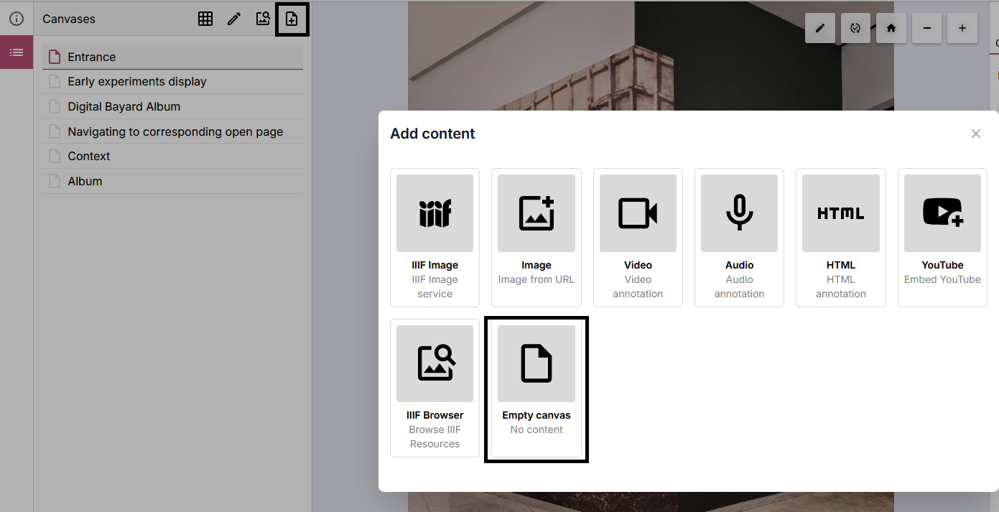
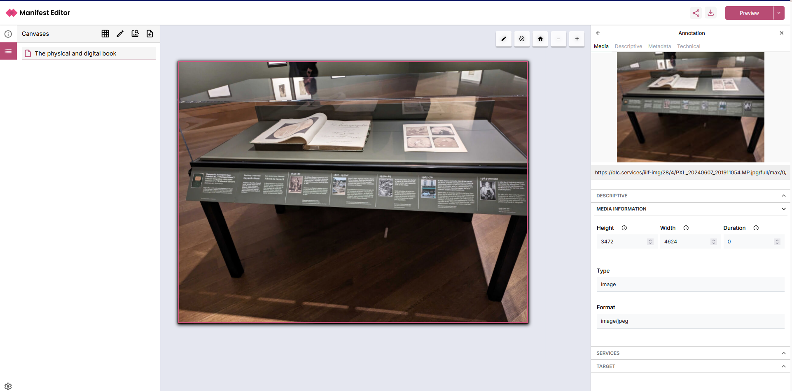

# Creating a new IIIF Manifest

When you select to create a new Manifest, you will be presented the following screen, which prompts you to add content to the Manifest.

Alternatively, if you click on the canvas list icon on the left side within your manifest, you can add a new canvas from the sidebar.

## Adding content options

When you add a new content you are adding a new IIIF Canvas to the Manifest. A IIIF Canvas can have multiple types of content. The most common type is an image, but you can also add a video or audio file.

You will be prompted to choose a content type. We will cover the following on this page:
- [Adding from an Image URL](#adding-from-an-image-url)
- [Adding from an IIIF image service](#adding-from-an-iiif-image-service)
- [Importing from existing IIIF](#importing-from-existing-iiif)

### Adding from an Image URL
The most common way to add an image to a Manifest is to use a direct URL to the image. This can be a URL to an image on a website for example.

Simply paste the URL into the box and click "Create". The image will be added to the Manifest as a new Canvas.

<video controls src="/add-image-url.mp4" autoplay loop muted controls playsinline style={{ margin: '3em 0' }} />

### Adding from an IIIF image service
If you want to add content using existing IIIF image services, simply find the appropriate URL and use this option to create a canvas using that content.

<video controls src="/add-image-service.mp4" autoplay loop muted controls playsinline style={{ margin: '3em 0' }} />

### Importing from existing IIIF

The  enables browsing and searching through existing IIIF content, to select content to add to your Manifest.

<video controls src="/existing-iiif.mp4" autoplay loop muted controls playsinline style={{ margin: '3em 0' }} />

### Other available options

There are a range of other options to enable the addition of content to your Manifest. These include the following:

#### Video (Video annotation)
Paste in the URL of a video resource from the web. Preview it, then click ‘Add video’ to add a Canvas with that video as an annotation.

#### Audio (Audio annotation)
Paste in the URL of an audio resource from the web,  then click ‘Add audio’ to add a Canvas with that audio as an annotation.

#### HTML (HTML annotation)
Type or paste in HTML code, then click ‘Create’ to add a Canvas with the HTML added as text annotation.

#### YouTube 
Type or paste in the link to the required YouTube video, then click ‘Create’ to add a Canvas. TODO: What caveats need to be added here?

#### Empty Canvas (No content) 
Creates an empty canvas onto which you can add content - for example if you wanted to add multiple images to a single canvas.

#### List of Images (List of Images from URLs)
Paste multiple image full URLs from the web, one per line. Then for each image URL, a Canvas containing the image will be added. Note IIIF-enabled assets are not supported in this bulk import option.

## Creating canvases with multiple images

You may want to add multiple image(s) to a canvas as part of your manifest. This could be a collection of pages from a book or paper or a series of images.

To create this, select the ‘Add canvas’ option in the left hand panel, and then select to add an “Empty canvas”:

Click on the canvas in the left hand panel. Add a label to your canvas using the right hand side metadata panel. 

To add the first image, click the ‘+ Add media’ option in the right hand side Canvas metadata tab:

Select the first image you wish to add, using the appropriate image option. Once you have selected the image, it will be loaded into the Canvas, using the whole canvas area as below:

In the right hand metadata panel for the newly added image, scroll to find the ‘Target’ for the selected image:

Select the ‘Change’ option, to enable you to position the selected image on the canvas as required. Clicking the pencil icon, as highlighted below, will enable you to move and resize the selected image:

Once you have positioned and resized your image as desired, you can select to ‘Finish editing’ . You can then either click on the Canvas label in the left hand panel, or use the ‘Back’ arrow in the right hand panel to return to the Canvas:

To add another image to the Canvas, click on the ‘+ Add media’ option, and select the image you want to add, using the appropriate option. In the example below, an IIIF Image service image is selected for addition to the canvas:

Repeating the steps above, you can use the pencil icon to enable you to resize and move the selected image as required. 

You can validate that the images have been correctly added, and positioned appropriately for your canvas by using the ‘Preview’ option, selecting Theseus to view your manifest. 

