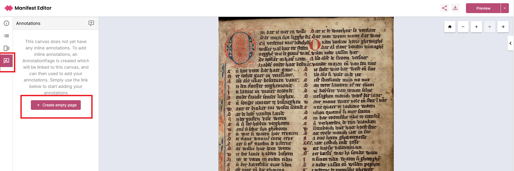
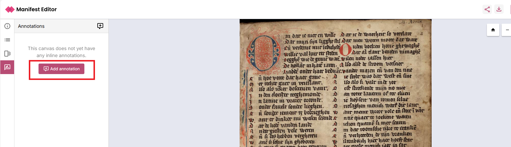
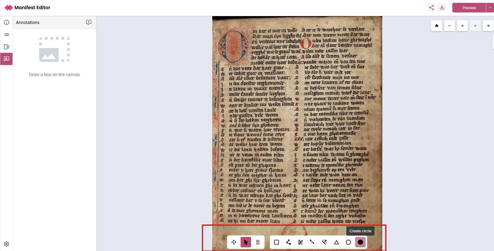
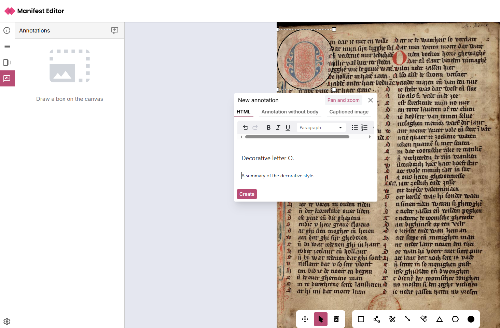
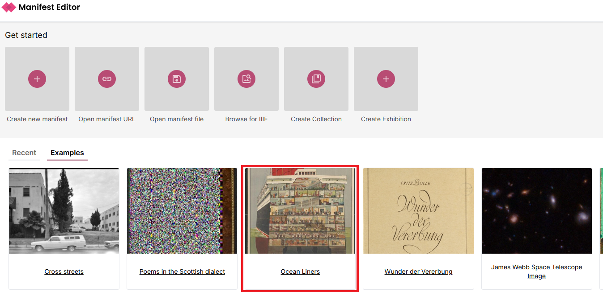

# Creating annotations

The Manifest Editor left hand toolbar provides a link to view and edit Annotations associated with Canvases in your selected Manifest.  

Clicking on the Annotations option will either present annotations associated with the canvas (if there are existing inline annotations) or allow you to create an empty Annotation Page to start adding annotations to the canvas.

## Creating annotations

To add new annotations to a Canvas in your Manifest, click on the Annotations link, and select the option to ‘Create empty page’

This will add an Annotation Page onto which your individual annotations can be added. Click to ‘Add annotation’ to start adding annotations to your canvas.

Use the annotation toolbar to select the appropriate region of the Canvas where you want to add an annotation. The toolbar provides a number of region selection options including a standard box, line, free form edit, triangle, polygon and circle shapes to get you started. 

Draw your region on the Canvas. The Annotation selection modal will then be presented, allowing you to select one of three options:

- HTML annotation - enabling you to add HTML content
- Annotation without body - no additional content added, the annotation is simply the region of the canvas selected.
- Captioned image - you can select an image using its URL and add a caption.

Once you have added any annotation content, click create to add your annotation.

As you add your Annotations, they are listed in the left hand panel where you can click to Edit or Delete them as required.

You can preview your Annotations using a IIIF viewer, in the screenshot below, Theseus is used to validate how the annotations are displayed, by selecting the ‘Show annotations’ link when viewing a Canvas with annotations.

## Viewing existing Annotations

To view existing Annotations associated with one or more Canvases in your selected Manifest, you can access the Annotations icon which will open the Annotations listing view for the selected canvas. To see how this works, you can view an example, if you navigate to the ‘Examples’ tab on the Manifest Editor homepage, and select the Victorian and Albert Museum’s ‘Ocean Liners’ IIIF Manifest example. 

This Manifest contains a single Canvas with a series of annotations. Once you have opened it, select the Annotations option in the left toolbar to view these annotations:

## Notes on annotation editing:

As indicated in the [IIIF Presentation specification](https://iiif.io/api/presentation/3.0/#55-annotation-page), the association of images and other content with the Canvases is via W3C Annotations. The structure created when using the Manifest Editor follows the resource structure of an Annotation Page with Annotations. 

While the latest Manifest Editor release has introduced the left toolbar Annotations link for ease of access, the right metadata panel (Structure tab) continues to provide access to create / edit and update inline annotations and can still be used.

When working with the standard Manifest Editor note that:

- Any annotations created will be stored within the IIIF Manifest you create
- The Manifest is stored in temporary browser storage when you are working with the standard Manifest Editor
- To save your work, you should ensure you have downloaded and saved the Manifest to appropriate persistent storage

