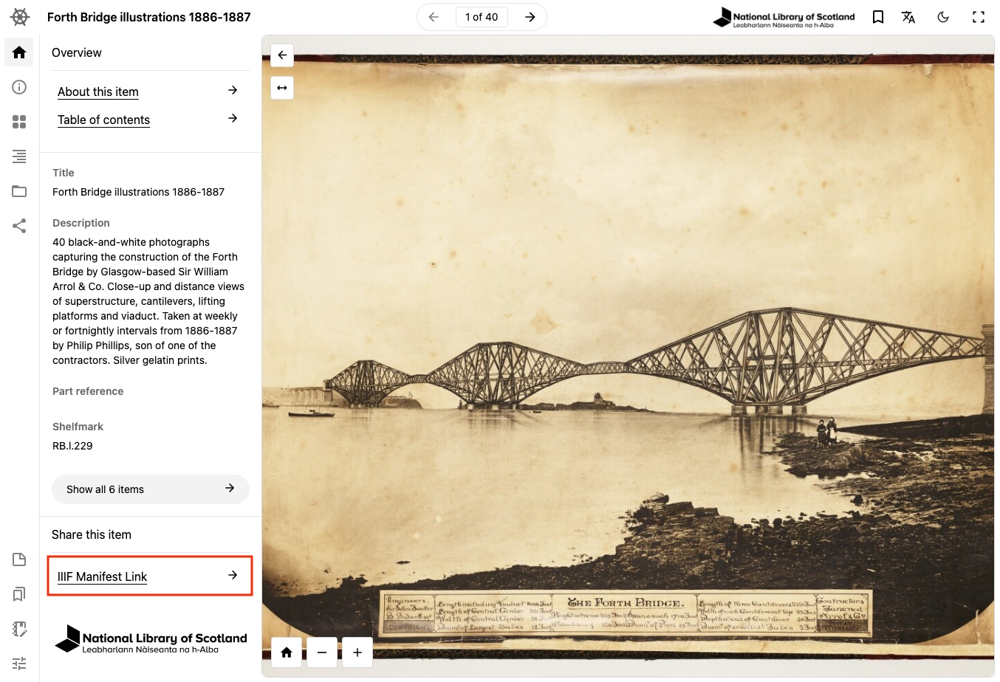

# Getting started

The IIIF Manifest Editor is a web-based tool for creating and editing IIIF manifests. It is designed to be easy to use, and to provide a visual interface for creating and editing manifests. This guide will walk you through the basics of creating and editing manifests with the IIIF Manifest Editor.

A Manifest is a JSON-LD file that describes a collection of images, audio, video, and other resources. It is used to provide metadata and structure for a collection of resources, and to define how those resources should be displayed in a IIIF viewer.

Sometimes a manifest will be used to describe a manuscript, a book, a collection of images, or a single image. The manifest can include information about the resources, such as their title, description, and licensing information. Manifests can also include annotations that provide additional information about the resources, such as transcriptions, translations, or other metadata.

## Finding a Manifest to edit

The best way to get started is to open an example Manifest and start editing it. This will allow you to see how the Manifest Editor works, and to get a feel for how to create and edit manifests.

There are lots of places where you can find IIIF Manifests that have been published by institutions. You can find some IIIF Collections from the [Theseus Viewer](https://theseusviewer.org) homepage.

You can explore some of these collections:

- [National Library of Scotland](https://theseusviewer.org/?iiif-content=https://view.nls.uk/collections/top.json&ref=manifest-editor)
- [Wellcome Collection](https://theseusviewer.org/?iiif-content=https://iiif.wellcomecollection.org/presentation/v3/collections/archives&ref=manifest-editor)
- [Bodleian Libraries](https://theseusviewer.org/?iiif-content=https://iiif.bodleian.ox.ac.uk/iiif/collection/top&ref=manifest-editor)
- [University of Leipzig](https://theseusviewer.org/?iiif-content=https://iiif.ub.uni-leipzig.de/static/collections/toplevel.json&ref=manifest-editor)
- [Villanova University](https://theseusviewer.org/?iiif-content=https://digital.library.villanova.edu/Collection/vudl:3/IIIF&ref=manifest-editor)
- [TUDelft](https://theseusviewer.org/?iiif-content=https://delft-iiif.netlify.app/collection.json&ref=manifest-editor)

Once you find a manifest that you want to open, you can copy the link from the
overview tab on the viewer.

## Opening IIIF content

There are a few ways to open a manifest in the Manifest Editor. The first we will look at is opening a Manifest from a link. At this point you should have a link to a IIIF manifest that you want to open.

From the [Manifest Editor](https://manifest-editor.digirati.services) homepage, click on the "Paste link" button at the top of the page. Paste the link in the text box, and click "Open".

<video src="/open-file.mp4" autoplay loop muted controls playsinline style={{ margin: '3em 0' }} />

Here you can start [editing the manifest](#basic-editing) and [previewing your changes](#previewing-changes) in a viewer.

## Creating a blank manifest

If you don't have a manifest to open, you can create a new blank manifest. From the [Manifest Editor](https://manifest-editor.digirati.services) homepage, click on the "New manifest" button at the top of the page.

This will open a new blank manifest in the editor, where you can start [adding resources](./adding-resources) and [editing the manifest](#basic-editing).

## Opening a manifest from a file

If you have previously download a Manifest from the Editor you can open it by clicking on the "Open file" button at the top of the page. This will open a file picker where you can select the manifest file you want to open.

## Basic editing

The Manifest Editor provides a visual interface for creating and editing manifests. You can add resources, such as images, audio, and video, to the manifest, and define how those resources should be displayed in a IIIF viewer.

The first thing we will do is change the label (or title) of the Manifest. This
is usually a prominent title that describes the content of the Manifest.

<video src="/editing-label.mp4" autoplay loop muted controls playsinline style={{ margin: '3em 0' }} />

- Ensure the "Manifest summary" sidebar is selected
- Click on the "Overview" tab
- Edit the "Label" field to change the title of the Manifest

You will see the Label of the Manifest change in the overview on the left hand side of the screen.

## Previewing changes

Once you have made changes to the Manifest, you can preview those changes in a IIIF viewer. You can open the preview by clicking on the "Preview" button at the top of the page. By default this will use [Theseus Viewer](https://theseusviewer.org) to display the Manifest. You can click on the drop down to select a different viewer.

<video src="/preview.mp4" autoplay loop muted controls playsinline style={{ margin: '3em 0' }} />

The viewers that are available are:

- [Theseus Viewer](https://theseusviewer.org)
- [Universal Viewer](https://universalviewer.io/)
- [Mirador 3](https://projectmirador.org/)
- [Annona](https://ncsu-libraries.github.io/annona/imageviewer/)
- [Clover](https://samvera-labs.github.io/clover-iiif/)

You can also view the JSON-LD from the preview by clicking on the "Raw Manifest" option from the dropdown.

The preview links are shareable, so you can share the link with others to show them the Manifest you have created. However the link will only be availbable for a short period of time.
