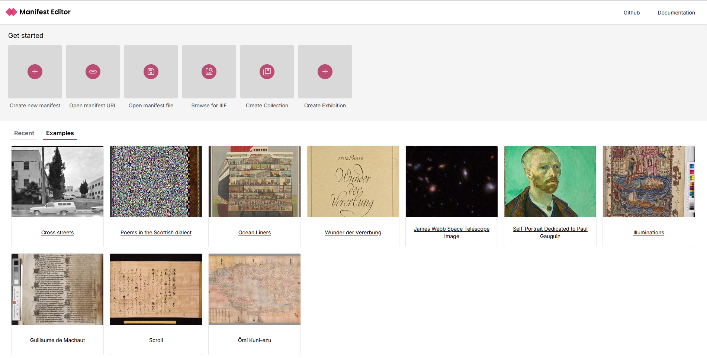

# Getting started

To get started, navigate to the IIIF Manifest Editor (https://manifest-editor.digirati.services/)

If you have an existing IIIF Manifest you wish to edit, you can open that using one of the available options:

- Open manifest URL - paste the public URL of the specific manifest
- Open manifest file - browse to existing IIIF content on your local machine or network drive
- Browse for IIIF - this launches the IIIF Browser, enabling you to search through existing IIIF content to find a specific item.

## Opening an existing IIIF Manifest

Using the Open manifest URL option, you just need the URL for the Manifest you wish to open.

From the [Manifest Editor](https://manifest-editor.digirati.services) homepage, click on the "Open manifest URL" button at the top of the page. Paste the link in the text box, and click "Open", which will open the manifest for editing.

<video src="/Opening a manifest - URL option.mp4" autoplay loop muted controls playsinline style={{ margin: '3em 0' }} />

Alternatively if you want to open a manifest from your local or network drive, click on the "Open manifest file" button and browse to locate your item, before opening it to allow editing.

The "Browse for IIIF" option, allows you to browse, search and select a IIIF Manifest to open from a specific IIIF Collection. The section [Using the IIIF Browser](./using-iiif-browser) describes how to use this feature, which is available for easy access to existing IIIF content in various locations in the Manifest Editor user interface.

## Creating a new IIIF manifest

To create a new manifest, select the option  the [Manifest Editor](https://manifest-editor.digirati.services) homepage, click on the "Create new manifest" button at the top of the page.

This will open a new empty manifest in the editor, where you can start curating the content you want to add to it. See [Creating a new IIIF Manifest](./adding-images) for more details.

## Opening a manifest from a file

If you have previously download a Manifest from the Editor you can open it by clicking on the "Open file" button at the top of the page. This will open a file picker where you can select the manifest file you want to open.

## Basic editing

As a quick example, the following video demonstrates changing the label (or title) of the Manifest. This is usually a prominent title that describes the content of the Manifest.

<video src="/editing-label.mp4" autoplay loop muted controls playsinline style={{ margin: '3em 0' }} />

The key steps include:

- Ensure the "Manifest summary" sidebar is selected
- Click on the "Overview" tab
- Edit the "Label" field to change the title of the Manifest

You will see the Label of the Manifest change in the overview on the left hand side of the screen.

For more details on editing, please see the section [Editing an existing Manifest](./manifest-editing)

## Previewing changes

Once you have made changes to the Manifest, you can preview those changes in a IIIF viewer. You can open the preview by clicking on the "Preview" button at the top of the page. By default this will use [Theseus Viewer](https://theseusviewer.org) to display the Manifest. You can click on the drop down to select a different viewer.

<video src="/preview.mp4" autoplay loop muted controls playsinline style={{ margin: '3em 0' }} />

The viewers that are available are:

- [Theseus Viewer](https://theseusviewer.org)
- [Universal Viewer](https://universalviewer.io/)
- [Mirador 3](https://projectmirador.org/)
- [Annona](https://ncsu-libraries.github.io/annona/imageviewer/)
- [Clover](https://samvera-labs.github.io/clover-iiif/)

You can also view the JSON-LD from the preview by clicking on the "Raw Manifest" option from the dropdown.

The preview links are shareable, so you can share the link with others to show them the Manifest you have created. However the link will only be availbable for a short period of time.
