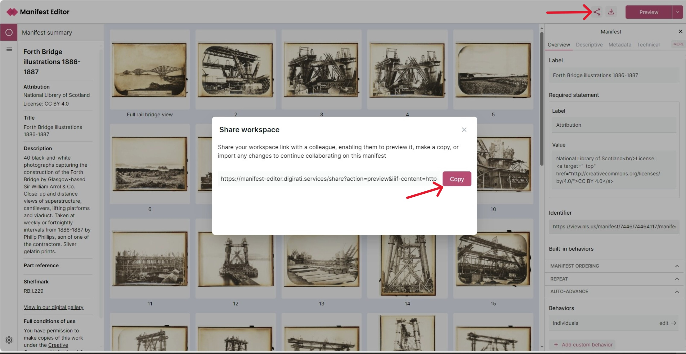

# Managing Workspaces

When you open a Manifest from a URL or a file, or when you create a blank Manifest it will be saved in your browsers local storage. This is called a workspace. You can have multiple workspaces and switch between them. Changes will be saved automatically.

You can see all your workspaces on the homepage. You can also delete workspaces from there using the 3 dots menu.

<video src="/workspace.mp4" autoplay loop muted controls playsinline style={{ margin: '3em 0' }} />

## Sharing workspaces

If you want to share your work with someone else, you can use the share feature. This will generate a URL that you can send to someone else.

They can open the URL and see your workspace. They can also make changes, but they will not be saved to your workspace. They can share their changes with you by generating a new share URL.
