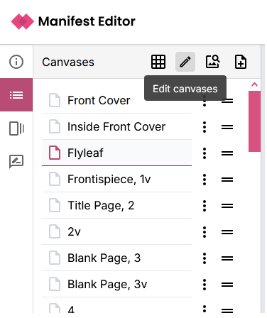
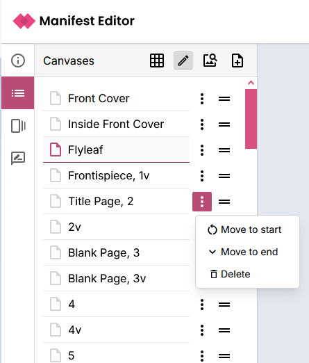
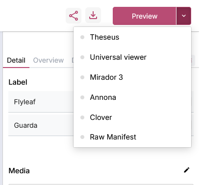

import { Callout } from 'nextra/components'

# Editing a Manifest

## Introducing the Manifest Editor layout

After selecting to open an existing manifest, or creating a new manifest (see [Getting started](./getting-started)) the Manifest Editor opens in the default workbench view:

The Manifest summary information is presented in the left panel, with the detailed metadata information in the right metadata panel, together with any canvases that are present in the manifest displayed in the central panel.

In the right metadata panel, you will see any completed properties in the “Overview” tab. This makes is easy to make quick edits without going through all the available properties or searching through the tabs. The tabs are organized in the same way as the IIIF Presentation API documentation. You can click on a tab to see all the properties that are available.

Some resources have a lot of properties. You can click on the “more” tab to see other tabs that are not shown by default. 

You can also resize either of the two sizebars to make more room for the editor by dragging the divider between the sidebar and the main panel.

## Navigating the editor layout

### Editing Manifest metadata

When you first open a manifest in the editor, you will see any Manifest summary in the left panel. You can start to edit the Manifest properties using the right metadata panel, with your changes to metadata properties (including the Label and Summary) reflected in the Manifest summary, autosaving as you edit.  

### Editing Canvases

If you click on an existing canvas, displayed in the central panel the editor will switch to editing the properties of that canvas. Alternatively, you can select the "Canvases" icon in the left toolbar, which will
open the Canvas view. You can get back to editing the manifest properties by clicking on the "Information" icon (Manifest Summary) in the sidebar.

<video src="/Navigating to Canvas view.mp4" autoplay loop muted controls playsinline style={{ margin: '3em 0' }} />

The Canvas view presents the list of available canvases in the left hand panel. You can access the list of canvases contained in the manifest using the list view or using a grid view of thumbnails.

The selected canvas is presented in the central view with deep zoom controls, with the right hand panel opening the detailed metadata for the selected Canvas.

### Deep zoom controls

When you select a canvas, you can deep zoom into the image by using the zoom controls at the top right of the main panel. You can also pan around the image by clicking and dragging.

From left to right, the icons are:

- Reset the zoom
- Zoom out
- Zoom in
- Navigate to the previous canvas
- Navigate to the next canvas

## Updating Manifest and Canvas metadata

The right metadata panel with tabs for each aspect of the IIIF specification, allows you to create, edit or update labels and values for the relevant properties.

### Example - Adding a required statement and rights

<video src="/required-statement.mp4" autoplay loop muted controls playsinline style={{ margin: '3em 0' }} />

## Ordering the canvases in your manifest

To edit and change the structure of your Manifest, for example to re-order or remove canvases from your IIIF Manifest, you can toggle the 'Edit Canvases' link to access the controls in both the list or grid views. Use the '=' icon to select and drag a canvas to a specific location in the list or use the options available via the 'three dots' icon.  

## Previewing a change

When you make changes to your Manifest, you can preview the changes in a number of IIIF viewers that are configured and available within the Manifest Editor including Theseus, Universal Viewer, Mirador and others.

