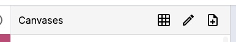

import { Callout } from 'nextra/components'

# Manifest editing

There are 2 preset configurations of the Manifest Editor:
- Manifest preset
- Collection preset

Each of these presets offers different UI that populate the sidebar, the main panel and the editor on the right.

The Manifest preset is the default configuration of the editor. It is designed to edit a single manifest. The sidebar is populated with the manifest properties, and the main panel is populated with the canvases of the manifest. When a canvas is selected, the editor on the right is populated with the properties of the selected canvas and the main panel shows a single canvas that can be deep zoomed.

## Navigating the editor
The Manifest Editor is divided into 3 main sections:
- The sidebar
- The main panel
- The editor

The editor tries to keep the flow from left to right. You can switch between
editing the manifest properties or the individual images using the icons on the left of the sidebar.

### Manifest vs Canvas editing
When you first open a manifest in the editor, you will see the manifest properties in the sidebar and all of the canvases (images) in the main panel displayed in a grid. If you click on one of the canvases, the editor will switch to editing the properties of that canvas. You can get back to editing the manifest properties by clicking on the information icon in the sidebar.

### Navigating to canvases

You can also click on the canvases listing icon in the sidebar menu to see a list of the canvases by label. You can click on a canvas to edit its properties. You can also switch the view to a 2x2 grid of canvases by clicking on the grid icon at the top.

From the same menu at the top you can also toggle reodering of the canvases by clicking on the "edit canvases" icon. This will allow you to drag and drop the canvases to reorder them.

<Callout type="warning">
  Reordering is not currently supported when viewing as a grid.
</Callout>

The last icon in the menu is for adding new canvases. When you click on this icon, you will be be able to choose a type of media to add. See [Adding images](./adding-images) and [Adding Audio and Video](./adding-av) for more information.

### Deep zoom controls

When you select a canvas, you can deep zoom into the image by using the zoom controls at the top right of the main panel. You can also pan around the image by clicking and dragging.

From left to right, the icons are:
- Edit annotations on the canvas
- Refresh canvas (forces a refresh)
- Reset the zoom
- Zoom out
- Zoom in

## Manifest sidebar
When you open manifest properties, you will see any filled out properties in the "Overview" tab. This makes is easy to make quick edits without going through all the available properties or searching through the tabs. The tabs are organized in the same was as the IIIF Presentation API documentation. You can click on a tab to see all the properties that are available.

Some resources have a lot of properties. You can click on the "more" tab to see other tabs that are not shown by default. You can also resize either of the two sizebars to make more room for the editor by dragging the divider between the sidebar and the main panel.

### Adding a require statement and rights

<video src="/required-statement.mp4" autoplay loop muted controls playsinline style={{ margin: '3em 0' }} />

### Adding metadata
Metadata can be added to either a Manifest or to individual Canvases and still be displayed by most viewers. Metadata can be added to other resources, but it's not guaranteed to be visible.

When you go to the metadata tab you can start by clicking "Add metadata item" and then filling out the label and value properties. The metadata is not meant to be a full representation of the metadata of the resource, but rather a way to present some key information to the user.

You can click on the "en" button to change the language or toggle the HTML formatting of the value.

If you click on the top right "Enable ordering" you will be able to drag and drop the metadata items to reorder them or delete them from the 3 dots menu.

## Supported properties

Not all viewers support all properties. The following table shows which properties are supported by some common viewers.

VIEWER MATRIX
- UV
- Mirador
- Theseus
