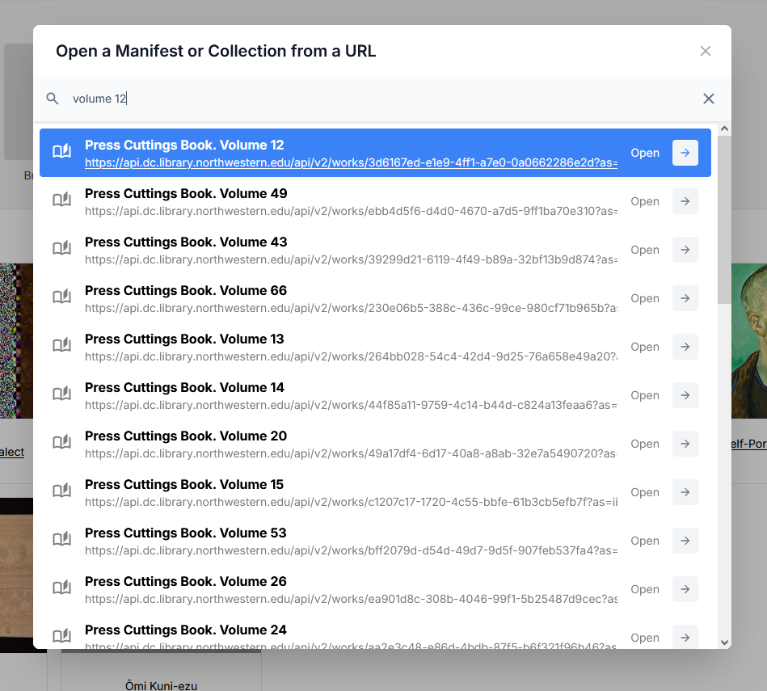
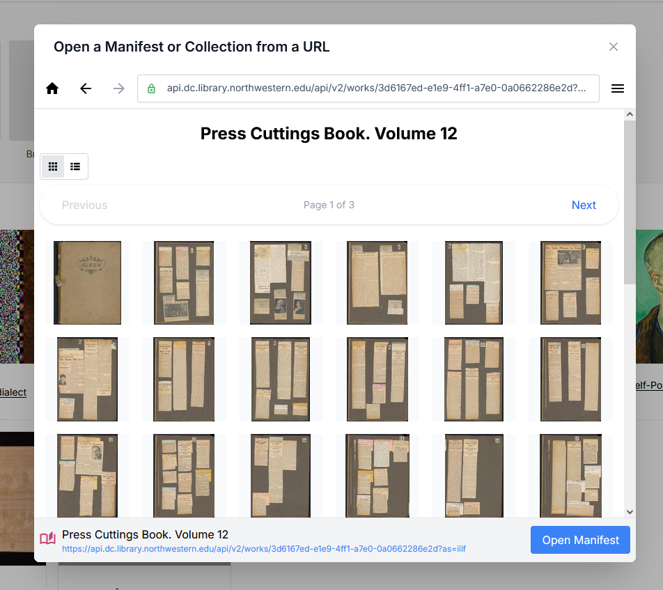

# IIIF Browser - Discover and Reuse existing IIIF content

The IIIF Browser lets you explore published IIIF Collections and Manifests. You can search, navigate, and import content directly into your Manifests. This helps you build on existing resources — for example, by reusing canvases or cropping images from other IIIF sources.

## Using the IIIF Browser to open IIIF content

The IIIF Browser is available as an option on the Manifest Editor homepage, allowing users to select and open existing IIIF content. You can also select this option when you are editing and adding content to your Manifest.

### Opening the IIIF Browser

1. On the Manifest Editor homepage, click “Browse for IIIF”.
2. The IIIF Browser will open in its default view.
3. If it’s your first time, the browser may be empty. Your previously visited URLs will be saved in your browser storage, making repeat access faster.

To start, select the URL of the IIIF content you wish to browse (this might be a IIIF Collection or a IIIF Manifest). Paste the URL into the browser URL bar as indicated in the screenshot below:

Click to open (or press return), and the browser will open the IIIF content. 

### Browsing the IIIF content

Once you have selected and opened IIIF content, the IIIF Browser provides options to navigate and search the available content. 

- The browser displays items in list view by default, but you can switch to grid view to see thumbnails.
- Use the navigation arrows or pagination to move through the collection.
- Click any item (collection or manifest) to explore into its contents.

In the screenshot below, selecting the Collection 'Dublin Gate Theatre Archive' opens that collection, enabling you to browse the contents.

### Searching the IIIF content

- Use the "Search Collection" option to help find the appropriate content. 
- This search uses the IIIF content labels to provide a basic search across the currently loaded collection, so make sure you are in the right context.

In the screenshot below, entering the term 'volume 12' filters and identifies the most appropriate IIIF content matching that term in the selected collection.

### Opening the IIIF content

To reuse existing IIIF content, click “Open in Manifest Editor” on the item you want.

This will load the selected Manifest for you to begin working with your copy of it.

## Using the IIIF Browser to add content to your manifest

You can use the IIIF Browser to discover and reuse existing IIIF content within your Manifest. You may want to add one or more canvases for example to your Manifest; or you might want to select a specific crop of an image
from an existing IIIF resource to include on your canvas.

### Creating a canvas using existing IIIF content

### Using the IIIF Browser to select and crop an image

