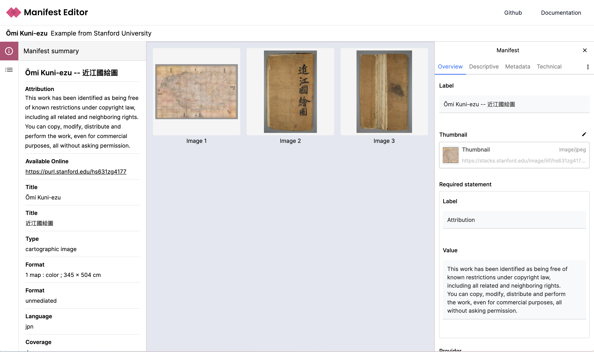

# Digirati IIIF Manifest Editor

- An extensible visual tool for creating IIIF Manifests and more
- Compatible with IIIF Presentation API 2 and 3
- Preview your work as you go in your viewer of choice
- Create IIIF Manifests to drive custom narratives and other viewing experiences
- Integrate the Manifest Editor into your own tools and workflows

- [See our Manifest Editor presentation at the 2022 IIIF Conference](https://www.youtube.com/watch?v=q9shfA3BqsM&list=PLYPP1-8uH9c6iAN6nZ-XWBhtwZW_lSesZ&index=1&t=7275s)
- [Try it!](https://manifest-editor-site.netlify.app/)

## Background

In 2017 we started working on [IIIF Manifest-driven narratives](https://medium.com/digirati-ch/reaching-into-collections-to-tell-stories-3dc32a1772af) for the V&A, and in 2018 for [Delft University of Technology Library](https://drive.google.com/file/d/1ZRXJaOYNbOD0jsOF79maKhxl5re4-2Kt/view). These were based on the first iteration of our [Canvas Panel](https://iiif-canvas-panel.netlify.app/) component.

In 2018 we developed an experimental [IIIF Workbench](https://www.youtube.com/watch?v=HHQdQ8Ti5eI&t=12s) for assembling complex canvases in a visual environment (like PowerPoint).

These combined to make a [IIIF Manifest Editor](https://www.youtube.com/watch?v=D8oA3rHbvPM) that in normal, default mode produces IIIF Presentation 3 Manifests, but can be extended with plugins to produce IIIF Manifests with particular structures and custom `behavior` properties, to drive custom viewing experiences - slideshows, guided viewing and the complex digital exhibition layouts seen in the Delft examples. Development of branches of the Manifest Editor for different clients went hand in hand with new viewers and static site generators.

## The new version

The new Manifest Editor builds on our experiences building content creation tools and custom viewing experiences. Our aim is for the new editor to be more sustainable, which in this context also means cheaper for ourselves and others to customise and adapt. This means a separation of viewing/previewing from content creation for most scenarios. We have ended up with multiple versions of the Manifest Editor, with different IIIF capabilities, user interfaces, and persistence mechanisms. Some versions integrate with our DLCS platform, allowing drag-and-drop creation of IIIF Image Services in real time.

We don't want to needlessly throw away the capabilities we have, but we want to maintain one editor going forward, that is simple and reliable to use, with excellent user experience. The needs of different adopters and users should be met by configuration, and choice of plugins, rather than different versions of the core editor.

## Audience

- People who want to learn IIIF
- IIIF novices using a visual, PowerPoint-like tool for creating Manifests intended for viewing in Universal Viewer, Mirador and other standard IIIF environments
- Museum staff assembling manifests intended for custom storytelling or digital exhibition environments
- People who need tools to enhance existing (perhaps machine-generated) IIIF with additional information and structure
- Researchers and students assembling their own IIIF by remixing existing sources
- (and many more in the issues and discussions)

## Features

- Create new Manifest
- Add Canvases
- Add single resources (media) to a Canvas
- Add multiple resources - create image choices, collages and more
- Browse IIIF (via IIIF Collections) to import Canvases
- Load any compliant version 2 or version 3 Manifest
- Edit all properties of Manifests and other IIIF resources
- Allow developers to make use of the Manifest Editor's application services to quickly develop extensions

## Join the discussion

We're using [GitHub discussions](https://github.com/digirati-co-uk/iiif-manifest-editor/discussions) to explore ideas, and the [Wiki](https://github.com/digirati-co-uk/iiif-manifest-editor/wiki) to think about implementation.

## Acknowledgements

The development of the IIIF Manifest Editor has been supported by:

- [Delft University of Technology Library](https://www.tudelft.nl/library)
- [The National Gallery](https://www.nationalgallery.org.uk/), [Practical applications of IIIF](https://tanc-ahrc.github.io/IIIF-TNC/) project funded by [AHRC](https://ahrc.ukri.org/) as a [Foundation Project](https://www.nationalcollection.org.uk/Foundation-Projects) within the [Towards a National Collection](https://www.nationalcollection.org.uk/) programme. [Dec 2021 - Apr 2022]
- [Canadian Research Knowledge Network](https://www.crkn-rcdr.ca/en)
