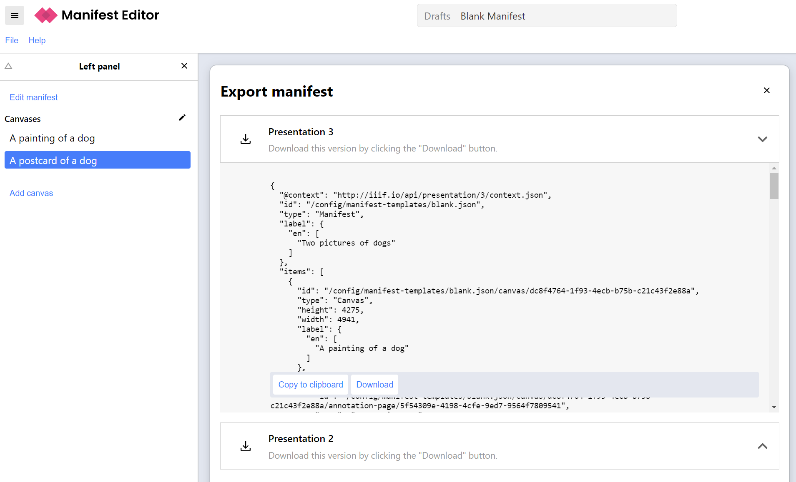

_Adapted from https://training.iiif.io/iiif-online-workshop/day-three/bodleian-editor/_

# Create a IIIF Manifest using the Digirati Manifest Editor

## Gather images

First, assemble a list of IIIF `info.json` URLs for your content. They should all be on HTTPS URLs (not unsecure HTTP).

 * Here is a sample image at the [Yale Center for British Art](https://images.collections.yale.edu/iiif/2/ycba:9e08d901-a26b-4acb-a768-28f90a062adf/info.json)
 * Here's another sample image at [Wellcome](https://iiif.wellcomecollection.org/image/V0037482/info.json)
 * Here are some [book pages from Wellcome](https://digirati-co-uk.github.io/me-testing/03-image-services.html)
   
## Use the Digirati Manifest Editor to create a manifest

Navigate to the editor at https://manifest-editor.digirati.services/

## Steps to create your Manifest

### Step 1

Click on the Create Empty Manifest option:

If you have previously been editing a Manifest in the editor, it will resume from where you left off. You can start a fresh Manifest from the File menu: **File** -> **New** -> **Blank Manifest**

### Step 2

Click the Add canvas link in the left hand menu

The Manifest Editor has a number of helpers for quickly creating Canvases from different sources. In this case, we're using IIIF Image Services. Select the **Image Service** option from the panel on the right.

Paste the URL of the info.json into the text box and click **Create**.

Once the image is loaded you should see something similar to the screenshot below. Note it may take a few minutes for the image to load if you are using the Internet Archive.  

Now edit the Canvas label, replacing the words "Untitled canvas" in the Label field in the right-hand panel:

Now repeat these steps to add a second canvas to your manifest, for example:

### Step 3

We are now going to edit the Manifest metadata to change the label. First click the **Edit manifest** link at the top of the left panel.

This changes the subject of the right panel. The right panel always edits whatever is selected in the left hand or center panels.

### Step 4

Now we are going to save and download the Manifest for the next stage. 

In the menu, click **File** -> **Export**.

The Manifest Editor gives you the option of IIIF Presentation 3 or 2. Click the **Download** button for Presentation 3:

This will save to your default downloads location.

### Step 5

You should now create a directory to store all of the manifests and other things we create during the course. We suggest you call it `iiif-workshop` and you move the downloaded Manifest to this directory and call it `manifest.json`. 