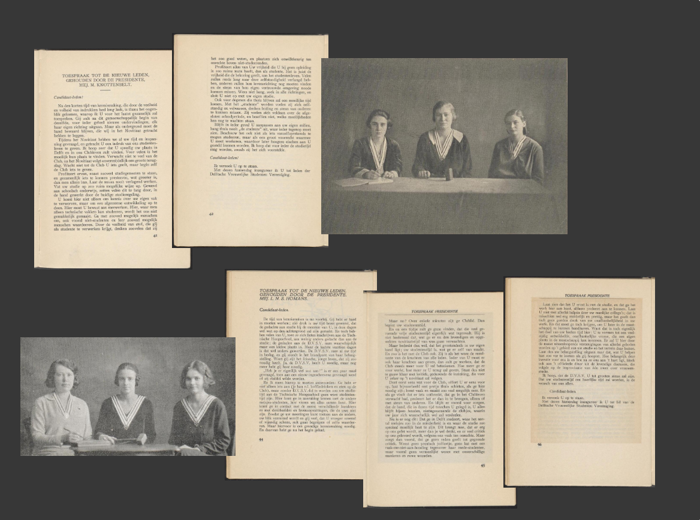

# Novieten (Novices)

This task creates a new Exhibition that is a reproduction of an existing one (to make comparison easier).

It also exercises creating an exhibition in both English and Dutch, as the single manifest drives both versions.

Here's the live version:

[English](https://heritage.tudelft.nl/en/exhibitions/novieten) | [Dutch](https://heritage.tudelft.nl/nl/exhibitions/novieten)

This exercise provides the text and the source IIIF resources to make the exhibition.

# Steps

Create a new Manifest and give it a `label` with two language values:

English (en):

```
Novices
```

Dutch (nl):

```
Novieten
```

## Canvas 1: The only woman in the lecture hall

Create a Canvas from an Image Service.

The Image Service to use is:

```
https://dlc.services/iiif-img/7/21/e16c7a6b-9672-d551-70d7-08c88609efb1
```

This image is in landscape format. However, you want a **crop** - use the full height of the image, but make it square.

You still want the _cropped_ image to fill the Canvas, so you may need to adjust the canvas dimensions to fit the cropped content.

The label to give the Canvas is:

English (en):

```
The only woman in the lecture hal
```

Dutch (nl):

```
De enige vrouw in de collegezaal
```

You're now going to use a special feature of Delft exhibitions that is not something you usually do in a general purpose manifest: you're going to give this piece of media its own `label` and `summary` properties. 

> _Technically speaking, you are going to set the `label` and `summary` properties of the `painting` annotation itself - rather than the Canvas. This is so the media can be used a tour step._

The `label` of the annotation is:

English (en):

```
The only woman in the lecture hall (Orientation Week 1965)
```

Dutch (nl):

```
De enige vrouw in de collegezaal (Introductieweek 1965)
```

And the `summary` is:

English (en):

```
TU Delft Library, Special Collections
```

Dutch (nl):

```
TU Delft Library, Bijzondere Collecties
```

> _In future this model might use `requiredStatement` for the latter - but the summary part of the tour step isn't always just an attribution._

We also need to set the custom `behavior` properties that guide the layout of the exhibition. For this canvas, we have two values to set:

```
w-8
h-8
```

...which makes the display panel square in the web page.

This panel is going to be a **Tour** - clicking the image will launch a tour. Tour steps are a sequence of annotations with the `motivation` property of `describing`. Tour steps can target the media on the canvas - the `painting` annotation(s) - or they can target arbitrary regions of the canvas. The latter is the more normal mode for a descriptive annotation, but the former is a handy way of explicitly tying tour steps to particular media on the canvas.

The first step of the tour is the whole image, so for this step we just create a `describing` annotation that targets (points to) the media we just added. The Manifest Editor will have created an entry in the media list that uses the label we gave it - "The only woman in the lecture hall (Orientation Week 1965)". It might also say "Image from Image Service".

> _The Manifest Editor uses assigned `label` properties for painting annotations in the UI - this is useful when building up exhibitions, guided viewing etc. Most normal manifests won't have labels for these `painting` annotations, so the Manifest Editor uses a summary of the type - where "Image from Image Service" or "Image with Image Service" are the most common, and just "Image" would be an image without an accompanying Image service._

> TODO: show exactly how to make this describing anno

The second (and last) step of the tour is a more conventional `describing` annotation - a step that focuses on a particular region of the canvas. 

Create a new `describing` annotation with a box target on the canvas, showing the only woman present (she's on the right hand side, about halfway down). Don't draw the box too tightly around her face, the exhibition will zoom in to this region. You want the box to be roughly square, but it doesn't have to be exact.

Now we need to provide a text body for this tour step. As this is a completely normal `describing` annotation we give it a standard textual body. In fact, we give it two bodies, one English and one Dutch. We'll need to specify the language for each, and also that the textual bodies are HTML. Here are the values:

English (en):

```
<h1>The only woman in the lecture hall (Orientation Week 1965)</h1>

<p>TU Delft Library, Special Collections</p>
```

Dutch (nl):

```
<h1>De enige vrouw in de collegezaal (Introductieweek 1965)</h1>

<p>TU Delft Library, Bijzondere Collecties</p
```

> _Again, this tour step looks slightly odd; we're matching the appearance of the other tour step where the heading and "body" are derived from the painting annotation label and summary. The other exercise, which builds an exhibition from scratch rather than re-creates a "legacy" exhibition, will show more flexible use of these properties._

The last step is to give the Canvas a thumbnail. If we go to edit the `thumbnail` property of the Canvas, we can see that we could get the Manifest Editor to generate one automatically from the existing image content. But in this case we know that we have a better thumbnail - so we paste in this image service:

```
https://dlc.services/thumbs/7/21/e16c7a6b-9672-d551-70d7-08c88609efb1
```

> _The Manifest Editor analyses this and creates a Thumbnail (as "Image from Image Service", or "Image with Image Service")._

## Canvas 2: Introduction

The next Canvas is a special _info_ text-only Canvas. For this we need to create an **empty** Canvas. Give it a matching height and width of `1000` (although it's not critical what the dimensions are).

Give the Canvas the following `behavior` property values:

```
info
w-4
h-4
```

Rather than content from media, we're going to give this Canvas a `painting` annotation made of text.

> TODO - what exactly do you do in the ME here?

The values to use are:

English (en):

```
<h1>Introduction</h1>

<p>In the past, new members of the 'Delftste Vrouwelijke Studentenvereniging' (DVSV – Delft student society for women) were called ‘novieten’ (‘novices’) as opposed to ‘feuten’ (with the connotation of ‘foetuses’), the term used for their male counterparts. After the first year, male students were welcomed into a robust community of men. Women, on the other hand, were a minority group. They were ‘politely ignored’ and expected to first prove themselves worthy. In the past, how did women deal with their role as a minority group?</p>
```

Dutch (nl):

```
<h1>Introductie</h1>

<p>Nieuwe leden van de Delftste Vrouwelijke Studentenvereniging (DVSV) werden in het verleden ‘novieten’ genoemd, tegenover de gebruikelijke term ‘feuten’ voor mannen. Maar anders dan hun mannelijke medestudenten, die na het eerste jaar werden opgenomen in een robuuste mannengemeenschap, werden de vrouwen als minderheid ‘beleefd genegeerd’ en geacht zich eerst maar eens te bewijzen. Hoe zijn vrouwen in het verleden omgegaan met hun minderheidsrol?</p>
```

This text is the content of the Canvas - but we also need to add the text that appears in the exhibition as a pop-up (from the "Read more" link), which is supplied as a regular `describing` annotation that targets the whole Canvas, rather than a region as in the previous example. The text to use is:

English (en):

```
<h1>Novices</h1>

<p>In the past, new members of the <em>Delftste Vrouwelijke Studentenvereniging</em> (DVSV – Delft student society for women) were called ‘<em>novieten</em>’ (‘novices’) as opposed to ‘<em>feuten</em>’ (with the connotation of ‘foetuses’), the term used for their male counterparts. After the first year, male students were welcomed into a robust community of men. Women, on the other hand, were a minority group. They were ‘politely ignored’ and expected to first prove themselves worthy.</p><p>The last year about which TU Delft published statistical data was 2018. Even though in that year an equal number of men and women were studying Architecture and Industrial Design, overall, the percentage of female first-year students at TU Delft remained below 30%. How did this develop over time and, in the past, how did women deal with their role as a minority group?</p><p>This digital exhibition starts with a graph that gives an overview of the number and percentage of female first-year students from 1905 to 2018. The year 1905 was chosen as the starting date because that was when the Polytechnic School became the 'Technische Hogeschool' (Institute of Technology) and women were able to study in Delft on a full-time basis. The graph does not show a linear progression, but rather a dynamic process with peaks and troughs. Using the graph, we can see several stories unfolding.</p><p>The first involves the DVSV, established in 1904. Female students came together and were active in this society, largely without an overarching emancipation programme. The speeches given to novices by presidents demonstrate how ‘girl students’ were expected to behave within the university community: ‘Above all, don’t stand out too much,’ was the main motto prior to WWII.</p><p>Out of a relatively high number of women in the pre-war years, the spotlight is turned on Antonia Korvezee who, in 1954, became the first female professor appointed at the Institute of Technology. Korvezee, who trained at the institute and obtained a PhD there, had worked at the famous lab of Marie Curie for some time in the early 1930s, focusing on the then new specialism of radioactivity. Later, as a professor, she used this knowledge to focus attention on that field in the Netherlands.</p><p>The story of the DVSV continues after WWII: Marian Geense wrote a book on the lives of the women who had been DVSV freshers with her in 1956. This exhibition contains a preprint version of the book. Another recent publication is featured. It tells the story of a still existing girls house in the heart of Delft: the Boterbrug, established in 1969. An interview with one of the founders of the house is reprinted here.</p><p>Mart van de Busken’s '<em>Mejuffrouw, Mijne Heren'</em> (Miss and Gentlemen) also dates back to the 1960s. This wonderful film provides a fascinating portrait of the institute at that time. The narrator is one of the ‘rare female students elevated to an icon’, the only ‘miss’ seated among all the ‘gentlemen’ in the lecture hall.</p><p>In the 1970s, both the absolute number and relative percentage of women started to increase. This marked the beginning of a new era in which women’s emancipation played a central role. For the exhibition, recent graduate Noortje Weenink interviewed Anna Vos, the founder of the Women’s Studies discipline within the Architecture Faculty. The interview reveals how female students challenged all kinds of norms that constituted the basis of their own field of study.</p><p>Anna Vos graduated under Franziska Bollerey who, in 1979, was the second female professor appointed at the Institute of Technology, 25 years after Korvezee. In the 1980s, Vos acted in a play during an information day for female students. The aim was to attract more women to enrol in technical studies.</p><p>The exhibition ends with the book '<em>Technische Universiteit, een mannenwereld'</em> (University of Technology, a Man’s World) published by Studium Generale in 1989. In this book, the perspective is reversed, and what it means to be a community of men is provocatively examined alongside what it would take to bring about change.</p><p>Despite the increasing number of 'novices' and the long tradition of female students and researchers at Delft, the university is still identified as a community of men. Diversity and inclusion are given high priority and it’s no longer just about the binary distinction between men and women. Nonetheless, the past experiences of women that are dealt with in this exhibition can serve as reference points for new generations so that – to paraphrase Anna Vos – they don’t have to keep rediscovering the wheel, but can build on the work of their predecessors.</p><p><em>Curated by Sarah Edrisy, Jules Schoonman and Abel Streefland (Academisch Erfgoed team, TU Delft Library). Graph design by Studio Mellegers van Dam.</em></p><p>With thanks to:</p><ul><li>Ted Barendse (Education &amp; Student Affairs)</li><li>Margreet de Boer</li><li>Marjan van den Bos</li><li>Mart van den Busken</li><li><a href="https://mariangeense.nl" rel="noopener noreferrer" target="_blank">Marian Geense</a></li><li>Marcel Janssen</li><li>Frida de Jong</li><li>Elizabeth Poot</li><li>Roland van Roijen (NewMedia Centre)</li><li>Anna Vos</li><li>Noortje Weenink</li><li>Charlotte van Wijk (Faculty of Architecture and the Built Environment)</li><li>Royal Library of the Netherlands</li><li>Atria, institute on gender equality and women's history</li></ul>
```

Dutch (nl):

```
<h1>Novieten</h1>

<p>Nieuwe leden van de Delftste Vrouwelijke Studentenvereniging (DVSV) werden in het verleden ‘novieten’ genoemd, tegenover de gebruikelijke term ‘feuten’ voor mannen. Maar anders dan hun mannelijke medestudenten, die na het eerste jaar werden opgenomen in een robuuste mannengemeenschap, werden de vrouwen ‘beleefd genegeerd’ en geacht zich eerst maar eens te bewijzen.</p><p>Ondanks dat in 2018 – het laatste jaar waarover de TU Delft statistische data heeft gepubliceerd – de studentenpopulaties van de studies Bouwkunde en Industrieel Ontwerpen uit een gelijk aandeel mannen en vrouwen bestaan, is het percentage vrouwelijke eerstejaars studenten aan de TU Delft over het geheel genomen nog altijd niet hoger dan 30%. Hoe heeft dit zich in de loop der tijd ontwikkeld en hoe zijn vrouwen in het verleden omgegaan met hun minderheidsrol?</p><p>Deze digitale tentoonstelling begint met een nieuwe grafiek die een overzicht geeft van het aantal en het percentage vrouwelijke eerstejaars in de periode 1905-2018. Als startdatum is 1905 gekozen omdat in dat jaar de Polytechnische School werd omgevormd tot Technische Hogeschool, waarmee vrouwen voltijds in Delft konden gaan studeren. De grafiek laat geen lineair proces zien, maar een dynamisch proces met pieken en dalen. Aan de hand van de grafiek ontvouwen zich een aantal verhalen.</p><p>Allereerst over de DVSV, opgericht in 1904, waarin vrouwelijke studenten zich verenigden en ontplooiden, grotendeels zonder een overkoepelend emancipatorisch programma. De speeches van presidentes aan de novieten laten zien hoe ‘meisjes-studenten’ zich geacht werden te gedragen binnen de universitaire gemeenschap: "val vooral niet te veel op," was het voornaamste devies vóór de Tweede Wereldoorlog.</p><p>Van het relatief hoge aandeel vrouwen in de vooroorlogse jaren, wordt Antonia Korvezee uitgelicht, die in 1954 werd aangesteld als eerste vrouwelijke hoogleraar van de Technische Hogeschool. Korvezee, in Delft opgeleid en in Delft gepromoveerd, werkte begin jaren dertig enige jaren in Parijs bij madame Curie aan het toen nieuwe specialisme van radioactiviteit. Deze kennis gebruikte ze later als hoogleraar om het vakgebied in Nederland op de kaart te zetten.</p><p>Het verhaal over de DVSV loopt door na de Tweede Wereldoorlog: Marian Geense schreef een boek over de levensloop van de vrouwen uit haar jaarclub uit 1956. Deze tentoonstelling bevat een voorpublicatie. Ook wordt een recente publicatie uitgelicht over een nog steeds bestaand vrouwenhuis in de Delftse binnenstad: de Boterbrug, opgericht in 1969. Een interview met één van de oprichtsters van het huis is hier opnieuw gepubliceerd.</p><p>Tevens uit de jaren zestig stamt de fictieve documentaire ‘Mejuffrouw, Mijne Heren’ van Mart van de Busken. De glorieuze film geeft een geweldig tijdsbeeld van de TH. De verteller is een van de 'zeldzame, tot idool verheven' vrouwelijke studentes, die als enige 'mejuffrouw' plaatsneemt tussen de mannen in de collegezaal.</p><p>Vanaf de jaren zeventig loopt zowel het absolute aantal als het relatieve percentage vrouwen op. Hiermee dient zich een nieuw tijdperk aan waarin vrouwenemancipatie een centrale rol inneemt. Voor de tentoonstelling heeft de recent afgestudeerde Noortje Weenink een interview afgenomen met Anna Vos, de oprichtster van het vak Vrouwenstudies aan de Faculteit Bouwkunde. Het gesprek laat zien hoe vrouwelijke studenten allerlei normen aan de kaak stelden die de basis vormden van hun eigen vakgebied.</p><p>Anna Vos studeerde af bij Franziska Bollerey die in 1979 werd aangesteld als tweede vrouwelijke hoogleraar aan de TH Delft, 25 jaar na Korvezee. In de jaren tachtig speelde zij in een toneelstuk tijdens een van de <em>meisjesinformatiedagen</em>, bedoeld om meer vrouwelijke studenten aan te trekken voor technische studies.</p><p>De tentoonstelling sluit af met het boek <em>Technische Universiteit, een mannenwereld</em>, uitgegeven door Studium Generale in 1989. In het boek is de blik omgedraaid en wordt prikkelend onderzocht wat het betekent om een mannengemeenschap te zijn –&nbsp;en wat ervoor nodig is om deze te veranderen.</p><p>Ondanks het toenemende aantal 'novieten' en de lange geschiedenis van vrouwelijke studenten en onderzoekers in Delft, staat de universiteit tegenwoordig nog steeds te boek als een mannengemeenschap. De thema's diversiteit en inclusiviteit staan hoog op de agenda, waarbij het al lang niet meer gaat om enkel het binaire onderscheid tussen mannen en vrouwen. De eerdere ervaringen van vrouwen die in deze tentoonstelling aan bod komen, kunnen desalniettemin handvaten aanbieden voor nieuwe generaties zodat zij (in de woorden van Anna Vos) niet telkens het wiel opnieuw hoeven uit te vinden maar kunnen voortbouwen op het werk van hun voorgangers.</p><p><em>Samengesteld door Sarah Edrisy, Jules Schoonman en Abel Streefland (Academisch Erfgoed team, TU Delft Library). Opmaak grafiek door Studio Mellegers van Dam.</em></p><p>Met dank aan:</p><ul><li>Ted Barendse (Education &amp; Student Affairs)</li><li>Margreet de Boer</li><li>Marjan van den Bos</li><li>Mart van den Busken</li><li><a href="https://mariangeense.nl" rel="noopener noreferrer" target="_blank">Marian Geense</a></li><li>Marcel Janssen</li><li>Frida de Jong</li><li>Elizabeth Poot</li><li>Roland van Roijen (NewMedia Centre)</li><li>Anna Vos</li><li>Noortje Weenink</li><li>Charlotte van Wijk (Faculteit Bouwkunde)</li><li>Koninklijke Bibliotheek</li><li>Atria, kennisinstituut voor emancipatie en vrouwengeschiedenis</li></ul>
```

The exhibition viewer knows what to do with this canvas, driven by the `info` value of the `behavior` property.

## Canvas 3: First-year students at the Delft Institute of Technology and TU Delft in the period 1905-2018

This canvas introduces another kind of exhibition special rendering. Whereas the previous canvas was a text-only info panel, this next canvas is a combination of info panel and multimedia content / tour steps in the same Canvas. The `behavior` property configures where the text sits in relation to the media, as well as the size:

```
right
w-12
h-8
```

Create a new canvas from an image service, as in the first example. The image service to use is:

```
https://dlc.services/iiif-img/7/21/4d8776d3-31a9-bf36-22ad-536c39f6ba5d
```

This time there's no crop - that's all you need to do for the image content itself, it automatically targets the whole Canvas. 

However, we will as before give this painting annotation itself a `label` and a `summary`:

The label is:

English (en):

```
First-year students at the Delft Institute of Technology and TU Delft in the period 1905-2018
```

Dutch (nl):

```
Eerstejaarsstudenten van de TH en TU Delft in de periode 1905-2018
```

And the summary is:

English (en):

```
Sources: Delft Institute of Technology Yearbooks and reports, TU Delft Statistical Yearbooks and OSIRIS
```

Dutch (nl):

```
Bronnen: Jaarboeken en -verslagen TH Delft, Statistisch jaarboeken TU Delft en OSIRIS
```

The Canvas also needs a label, which can be the same as the annotation label (we will vary these in future for different effects).

English (en):

```
First-year students at the Delft Institute of Technology and TU Delft in the period 1905-2018
```

Dutch (nl):

```
Eerstejaarsstudenten van de TH en TU Delft in de periode 1905-2018
```

For this panel, the Canvas also gets a `summary` property - it's this that will provide the text panel. Note that here we don't have to provide HTML, we can provide several string values (as separate values) and leave the formatting up to the exhibition viewer:

English (en):

```
This graph shows the absolute number of first-year students, the distribution of men and women, and the percentage of women. It was only possible for women to follow a full-time technical study at Delft from 1905.

A striking aspect of the graph is that the percentage of women before WWII was higher than in the period that followed. The percentage only increases to more than 11% – the highest pre-war percentage – in 1983.

Over the course of time, the definition of first-year students changed. Up until 1982, no statistical distinction was made between different types of first-year students. From 1982, the numbers given for first-year students include 'internal switchers' (students who changed to a different study) because these figures were best in line with earlier data. The introduction of the bachelor’s-master’s system in 2002 also had an impact on the calculation method which probably explains the ‘dip' the graph shows in that year.
```

Dutch (nl):

```
Deze grafiek toont het absolute aantal eerstejaars studenten, de verdeling tussen man en vrouw en het percentage vrouwen. Pas vanaf 1905 is het voor vrouwen mogelijk om in Delft een volledige technische studie te volgen.

Opvallend aan de grafiek is dat het percentage vrouwen vóór de Tweede Wereldoorlog hoger is dan in de periode erna. Pas in 1983 stijgt het percentage weer uit boven de 11%, het maximum uit de vooroorlogse jaren.

In de loop der tijd is de definitie van eerstejaars studenten veranderd. Tot 1982 wordt er in de statistieken geen onderscheid gemaakt tussen verschillende soorten eerstejaars. Vanaf 1982 zijn de aantallen eerstejaars gebruikt inclusief 'interne omzwaaiers' (studenten die van studie wisselen), omdat deze het best overeenkwamen met de eerdere gegevens. Ook de invoering van de bachelor-masterstructuur in 2002 heeft impact gehad op de wijze van tellen, wat waarschijnlijk de 'dip' in de grafiek verklaart rond dat jaar.
```

The info panel also has a footer, which is provided by the `requiredStatement` property of the Canvas. Again we're going to repeat text used elsewhere, but later we can vary these to demonstrate how flexible the model is. You only need to supply the `value` of the requiredStatement - you can leave its `label` blank.

English (en):

```
Sources: Delft Institute of Technology Yearbooks and reports, TU Delft Statistical Yearbooks and OSIRIS
```

Dutch (nl):

```
Bronnen: Jaarboeken en -verslagen TH Delft, Statistisch jaarboeken TU Delft en OSIRIS
```

Now you need to create a tour. Like the first example this will be a pointer to the whole image as the first step, and a detail of the canvas as the second.

For the first step all you need to do is create an annotation with motivation `describing` that points at the single media (painting) annotation. The exhbition viewer picks up that annotation's label and summary and uses them.

For the second step, you need to draw attention to the bottom-left region of the canvas. Create a describing annotation whose target is a square-ish box that captures the bottom-left of the graph, up to around 1945.

This tour step needs the following text bodies for the annotation:

English (en):

```
<h1>Before the Second World War</h1>

<p>A striking aspect of the graph is that the percentage of women before WWII was higher than in the period that followed. The percentage only increases to more than 11% – the highest pre-war percentage – in 1983.</p>
```

Dutch (nl):

```
<h1>Voor de Tweede Wereldoorlog</h1>

<p>Opvallend aan de grafiek is dat het percentage vrouwen vóór de Tweede Wereldoorlog hoger is dan in de periode erna. Pas in 1983 stijgt het percentage weer uit boven de 11%, het maximum uit de vooroorlogse jaren.</p>
```
 
The last step is to add a `thumbnail` to the Canvas; again, we have an existing one - an image service, so create the thumbnail from this image service:

```
https://dlc.services/thumbs/7/21/4d8776d3-31a9-bf36-22ad-536c39f6ba5d
```

## Canvas 4: Don't be a prudish little miss

This is another multimedia plus info panel, but this time the other way round with the text on the left. It has a much bigger set of tour steps, and the tour steps correspond to 6 individual images placed onto the canvas.

> _Again, this is more complicated than it needs to be, as a legacy exhibition, but it demonstrates how to build tour steps from individual painting annotations._

Create an empty Canvas (i.e., not from a starting piece of media) and give it the dimensions w: 999, h: 762. The canvas `behavior` property values are:

```
left
w-12
h-6
```

The Canvas `label` values are (note the single quotes):

English (en):

```
'Don’t be a prudish little miss'
```

Dutch (nl):

```
'Weest geen preutsch juffertje'
```

As with the previous example the info text is provided by the Canvas `summary`:

English (en):

```
The DVSV (Delft student society for women), established in 1904, was a social club for female students at the Institute of Technology. Up until 1970, virtually all female students were members. In the 1920s, its membership was around 100 students.

Successive society presidents gave speeches to first-year students which included instructions. These speeches were printed in yearbooks. Up until 1940, the most important motto was: don’t stand out as a woman and be grateful for the opportunity to study in Delft. Any openly feminist attitude was rejected. This would only begin to change after WWII. You can read here the speeches given in 1930 and 1931.
```

Dutch (nl):

```
De Delftse Vrouwelijke Studentenvereniging (DVSV), opgericht in 1904, was een gezelligheidsvereniging voor vrouwelijke studenten aan de TH. Tot 1970 werden vrijwel alle vrouwelijke studenten lid. De vereniging telde in de jaren twintig ongeveer 100 leden.

In redes voor eerstejaars, afgedrukt in de almanakken, gaven de achtereenvolgende presidentes instructies aan de nieuwe leden. Tot 1940 is het belangrijkste devies: val niet op als vrouw en wees dankbaar voor de kans om in Delft te studeren. Een openlijke feministische opstelling werd afgekeurd. Pas na de Tweede Wereldoorlog zou dit geleidelijk gaan veranderen.
```

And some footer text is provided by the `requiredStatement` property. You only need to supply the `value` of the requiredStatement - you can leave its `label` blank.

English (en):

```
Click ‘Start tour' and then 'View object' to view the complete yearbooks.
```

Dutch (nl):

```
Lees hier de redes uit 1930 en 1931. Klik op 'Start tour' en vervolgens op 'Bekijk object' om de volledige almanakken te bekijken.
```

This Canvas does not have a thumbnail, but it does have multiple _painting annotations_ which are sourced from existing IIIF content. Rather than paste in raw Image Service URLs, we can browse for the content we want using the IIIF Browser.

We want to end up with something like this:



These are seven images from existing IIIF Manifests, so we can use the IIIF Browser to pick them. 

> TODO: describe how to add new painting annotations with the picker.

The first two images are pp. 41 and 42 of this Manifest, which you can paste into the picker:

```
https://raw.githubusercontent.com/digirati-co-uk/delft-static-site-generator/master/content/collections/lib-library/lib-tresor-dvsv/lib-tresor-tr-almanak-dvsv-1930.json
```

The third image (in the top right) is a **crop** from pp 20 of the same Manifest. You select this with the picker in the same way, but this time you select a particular region of the page rather than the whole page.

The next images are the remaining three printed pages, this time from a different Manifest:

```
https://raw.githubusercontent.com/digirati-co-uk/delft-static-site-generator/master/content/collections/lib-library/lib-tresor-dvsv/lib-tresor-tr-almanak-dvsv-1931.json
```

(This is the 1931 yearbook rather than the 1930 one). You need pp 44, 45 and 46, again taking the whole image from the source Manifest.

The very last tour step is the photograph on the bottom left. This is again a crop, this time from page 20 of the 1931 yearbook.

Now we can assign some text to each of these 7 `painting` annotations. This text will form the text of the tour steps, when we turn them into tour steps in the last step later. But first, allocate the following text to the 7 images (painting annotations):

> _We could also assign the thumbnails to each of these, but it begins to get tedious. However, is the static site using these thumbnails? I think so... As these images are picked as canvases from a Manifest, and those Canvases have thumbnails, could the Manifest Editor automatically assign those canvas thumbnails to the individual images on this canvas? Would we want that? At the moment the thumbnails are properties of the painting annotation, although we can change that in the converter if we want to._

### Image 1 (p 41 from 1930):

#### label

English (en):

```
Speech to the new members in 1930
```

Dutch (nl):

```
Toespraak tot de nieuwe leden in 1930
```

#### summary

English (en):

```
1/2
```

Dutch (nl):

```
1/2
```


### Image 2 (p 41 from 1930):

#### label

English (en):

```
Speech to the new members in 1930
```

Dutch (nl):

```
Toespraak tot de nieuwe leden in 1930
```

#### summary

English (en):

```
2/2
```

Dutch (nl):

```
2/2
```

> _In the more sophisticated model we now support, these two could have been just one annotation targeting the canvas; you can see examples of this in the other exercise._

### Image 3 (p 20 from 1930):

#### label

English (en):

```
Board of D.V.S.V. 1928-1929
```

Dutch (nl):

```
Bestuur der D.V.S.V. 1928-1929
```

#### summary

(leave blank)


### Image 4 (p 44 from 1931):

#### label

English (en):

```
Speech to the new members in 1931
```

Dutch (nl):

```
Toespraak tot de nieuwe leden in 1931
```

#### summary

English (en):

```
1/3
```

Dutch (nl):

```
1/3
```

### Image 5 (p 45 from 1931):

#### label

English (en):

```
Speech to the new members in 1931
```

Dutch (nl):

```
Toespraak tot de nieuwe leden in 1931
```

#### summary

English (en):

```
2/3
```

Dutch (nl):

```
2/3
```

### Image 6 (p 46 from 1931):

#### label

English (en):

```
Speech to the new members in 1931
```

Dutch (nl):

```
Toespraak tot de nieuwe leden in 1931
```

#### summary

English (en):

```
3/3
```

Dutch (nl):

```
3/3
```


### Image 7 (crop from p 20 from 1931):

#### label

English (en):

```
Board of D.V.S.V. 1929-1930
```

Dutch (nl):

```
Bestuur der D.V.S.V. 1929-1930
```

(leave summary blank)

After having given the painting annotations their labels and (in most cases) summaries, you have populated the scene, but you have not turned it into a Tour.

To do this, you need to create a describing annotation for each of the painting annotations. You don't need to give the describing annotations any text or other properties of their own, just target them at the painting annotations you just created.

This creates a tour of seven steps.


## Canvas 5: Tube with the PhD award certificate of Antonia Korvezee

The next panel is much simpler - just a single object.

Create a new Canvas from content, by selecting the single Canvas from this IIIF Manifest:

```
https://raw.githubusercontent.com/digirati-co-uk/delft-static-site-generator/master/content/objects/dc434947-cd67-4361-8780-93cae5aa5688.json
```

(you'll need to use the picker).

Give the canvas the following `label`:

English (en):

```
Tube with the PhD award certificate of Antonia Korvezee
```

Dutch (nl):

```
Koker met promotiebul van Antonia Korvezee
```

And then give the `painting` annotation itself (the media) the following:

#### label

English (en):

```
Tube with the PhD award certificate of Antonia Korvezee
```

Dutch (nl):

```
Koker met promotiebul van Antonia Korvezee
```

#### summary

English (en):

```
TU Delft Library, Special Collections, 2016.0290.LIB
```

Dutch (nl):

```
TU Delft Library, Bijzondere Collecties, 2016.0290.LIB
```

The Canvas should have brought with it the thumbnail it had in its source Manifest, so you don't need to assign a thumbnail.

The `behavior` property values of this Canvas are:

```
w-8
h-6
```


## Canvas 6: Info Panel for previous canvas

This next example shows the variation possible - this is a separate info canvas that, when combined with Canvas 5, looks like the layout of Canvases 3 and 4. Why do this? Because in this case the info panel is the specialist info panel that has accompanying text that pops out full screen, a feature not available in the combined version in Canvases 3 and 4.

Create a new empty Canvas and set the width and height to 1000. Give it the `behavior` values: 

```
info
w-4
h-6
```

Now create a `painting` annotation with a textual body, using the values:

English (en):

```
<h1>Prof. Antonia Korvezee</h1>

<p>In 1954, Antonia Korvezee (1899-1978) became the first female professor at the Institute of Technology in Delft. Although born in Friesland she grew up in The Hague, where she attended the ´HBS for boys´ (former Dutch pre-university secondary school).</p>

<p>Based on her aptitude for maths, she decided to study in Delft. In 1922, she graduated cum laude in Chemical Technology and worked for two years as an analytical chemistry assistant. She continued her studies in Delft by performing PhD research under Professor Scheffer. In 1930, she was awarded a PhD cum laude for her research into copper chloride as a catalyst.</p>

<p>Of the 26 dissertations written in Professor Scheffer’s lab, 5 were by women – a high percentage at the time.</p>
```

Dutch (nl):

```
<h1>Prof. Dr. Ir. Antonia Korvezee</h1>

<p>Antonia Korvezee (1899-1978) werd in 1954 de eerste vrouwelijke hoogleraar aan de Technische Hogeschool in Delft. Ze werd geboren in Friesland maar groeide op in Den Haag, waar ze de ‘HBS voor jongens’ doorliep.</p>

<p>Vanwege haar aanleg voor wiskunde besloot ze in Delft te gaan studeren. In 1922 studeerde ze cum laude af in de scheikundige technologie en werd ze voor twee jaar assistente bij analytische scheikunde. Ze vervolgde haar opleiding in Delft door bij professor Scheffer een promotieonderzoek te doen. In 1930 promoveerde ze met lof op een onderwerp over koperchloride als katalysator.</p>

<p>Van de 26 dissertaties die binnen het lab van professor Scheffer werden geschreven waren er 5 van de hand van vrouwen - voor die tijd een hoog percentage.</p>
```

And now a `describing` annotation, targeting the whole Canvas, with the values:

English (en):

```
<h1>Prof. Antonia Korvezee (1899-1978)</h1>

<p>In 1954, Antonia (Toos) Korvezee (1899-1978) became the first female professor at the Institute of Technology in Delft. Although born in Friesland she grew up in The Hague, where she attended the ‘HBS (former Dutch pre-university secondary school) for boys’. Based on her aptitude for maths, she decided to study in Delft. In 1922, she graduated cum laude in chemical technology and worked for two years as an analytical chemistry assistant. She continued her studies at Delft by performing PhD research under Professor Scheffer. In 1930, she was awarded a PhD cum laude for her research into copper chloride as a catalyst. Of the 26 dissertations written in Professor Scheffer’s lab, 5 were by women – a high percentage at the time.</p><p>In the early 1930s, Korvezee received a grant from the Delft Institute of Technology Fund allowing her to work for several semesters in Paris with Irene Curie on the then new specialism of radioactivity. On her return to Delft, she became a <em>privaatdocente</em> (lecturer in a new discipline that has no professorial chair) in that discipline. Such positions had little status but often served as the first step towards the creation of a new professorial chair.</p><p>The outbreak of WWII meant that things turned out differently for Korvezee. She left Delft and went to work for a company in Venlo. She returned to Delft after the war and found a changed landscape: the laboratory approach had made way for the engineering approach of post-war reconstruction and industrialisation ambitions in line with the American model. The new focus areas included the petrochemical industry, process manufacturing and nuclear energy.</p><p>Korvezee was an expert in the latter field and was appointed a lecturer in 1948. However, she was passed over as the successor to her mentor Scheffer and she was left out of the preparations to establish a prestigious institute for nuclear energy studies. Korvezee’s duties shifted towards teaching. She supervised 5 PhD candidates, but did not establish her own school. In 1954, she became a professor by special appointment in the field of Theoretical Chemistry. She began to feel unwell in 1959 and complained about ‘an overwhelming tiredness’. Her illness forced her to submit her resignation. No ceremony marked Korvezee’s departure. She died in The Hague in 1978.</p><p>There were no successors to Korvezee. After the war, there were just a few women in the Engineering Physics and Fibre Technology departments. Despite a significant increase in the number of professorial chairs in the 1950s and ‘60s, it took 25 years for another woman to become a professor: Franziska Bollerey who, in 1979, was appointed professor of the History of Architecture and Urban Planning at the Architecture Faculty. In 1989, an annual emancipation award was introduced at TU Delft: the Antonia Korvezee Prize, but it was abandoned several years later.</p><p>Further reading: Frida de Jong, <em>Standhouden in Delft</em>, Gewina 20 (1997), pp. 227-243.</p>
```

Dutch (nl):

```
<h1>Prof. Dr. Ir. Antonia Korvezee (1899-1978)</h1>

<p>Antonia (Toos) Korvezee werd in 1954 de eerste vrouwelijke hoogleraar aan de Technische Hogeschool in Delft. Ze werd geboren in Friesland maar groeide op in Den Haag, waar ze de ‘HBS voor jongens’ doorliep. Vanwege haar aanleg voor wiskunde besloot ze in Delft te gaan studeren. In 1922 studeerde ze cum laude af in de scheikundige technologie en werd ze voor twee jaar assistente bij analytische scheikunde. Ze vervolgde haar opleiding in Delft door bij professor Scheffer een promotieonderzoek te doen. In 1930 promoveerde ze met lof op een onderwerp over koperchloride als katalysator. Van de 26 dissertaties die binnen het lab van professor Scheffer werden geschreven waren er 5 van de hand van vrouwen - voor die tijd een hoog percentage.</p><p>Begin jaren dertig werkte Korvezee met een toelage van het Delfts Hogeschoolfonds enige semesters in Parijs bij Irène Curie aan het toen nieuwe specialisme van radioactiviteit. Terug in Delft werd ze in 1935 privaatdocente in dit vakgebied. In status stelde dit niet veel voor, maar vaak kon dit dienen als een opstap naar een nieuw te creëren leerstoel.</p><p>Door tussenkomst van de Tweede Wereldoorlog liep het voor Korvezee echter anders. Ze vertrok uit Delft en werkte bij een bedrijf in Venlo. Na de oorlog keerde ze terug naar Delft, waar inmiddels een andere wind woei: de laboratoriumsfeer had plaatsgemaakt voor de ingenieursaanpak van de wederopbouw en het industrialisatiestreven volgens Amerikaans model. Nieuwe speerpunten waren procesindustrie, petrochemische industrie en kernenergie.</p><p>Op dat laatst gebied was Korvezee deskundige, zodat ze in 1948 werd benoemd tot lector. Bij de opvolging in 1953 van haar leermeester Scheffer werd ze echter gepasseerd en bij de voorbereiding om te komen tot een prestigieus instituut voor kernenergie-onderwijs werd ze niet betrokken. Haar taken verschoven in de richting van het onderwijs. Ze begeleide vijf promovendi, maar vestigde geen eigen school. In 1954 werd ze alsnog benoemd tot buitengewoon hoogleraar in de theoretische scheikunde. Vanaf 1959 voelde ze zich ziek en klaagde ze over ‘een alles overheersende vermoeidheid’. Haar ziekzijn noopte haar om ontslag te vragen. Haar afscheid gebeurde met stille trom. Ze overleed in Den Haag in 1978.</p><p>Opvolgsters heeft Korvezee niet gekend. Na de oorlog waren er aan de TH enkel bij de afdeling Technische Natuurkunde en bij de vakgroep Vezeltechniek nog enkel vrouwelijke collega’s werkzaam. Ondanks de grote uitbreiding van het aantal leerstoelen in de jaren vijftig en zestig duurde het 25 jaar voordat er weer een vrouw tot hoogleraar werd benoemd: Franziska Bollerey, die in 1979 hoogleraar in de architectuur- en stedenbouwgeschiedenis werd bij de afdeling Bouwkunde. In 1989 werd aan de TU een jaarlijkse emancipatieprijs ingesteld, de Antonia Korvezeeprijs, maar deze werd na enige jaren weer opgeheven.</p><p>Meer lezen: Frida de Jong, Standhouden in Delft, Gewina 20 (1997), pp. 227-243.</p>
```


## Canvas 7: Info Panel for next canvas

This Canvas and the next are a similar pair to the previous two, just the other way round.

Create another 1000 x 1000 info panel, with `behavior` values:

```
info
w-4
h-5
```

Now create a `painting` annotation with a textual body, using the values:

English (en):

```
<h1>‘My husband is not an architect – The architecture firm is mine'</h1>

<p>The legal 'incapacity of women' was abolished in the Netherlands in 1956. As a result, married female engineers could actually start to practise their profession.</p>

<p>In the soon to be published book 'Acht Vrouwen in een Mannenwereld: Van Delftsche Novieten tot Ingenieurs' (Eight Women in a Man’s World: From Delft Novices to Engineers)  Marian Geense describes the lives of her 1956 DVSV fellow freshers, and the prejudices women had to deal with in their profession. Here you can read a preprint version of the book based on 8 quotations.</p>
```

Dutch (nl):

```
<h1>'Mijn man is geen architect; dat architectenbureau is van mij'</h1>

<p>In 1956 werd de zogenoemde handelingsonbekwaamheid voor vrouwen in Nederland afgeschaft. Dit had als gevolg dat gehuwde vrouwelijke ingenieurs ook daadwerkelijk hun beroep konden gaan uitoefenen.</p>

<p>In het te verschijnen boek 'Acht Vrouwen in een Mannenwereld: Van Delftsche Novieten tot Ingenieurs' beschrijft Marian Geense de levensloop van haar jaarclub van de DVSV uit 1956, en de vooroordelen waarmee de vrouwen te maken krijgen in hun werkende leven. Lees hier een voorpublicatie van het boek op basis van acht citaten.</p>
```

And now a `describing` annotation, targeting the whole Canvas, with the values:

English (en):

```
<h1>Eight Women in a Man’s World: From Delft Novices to Engineers</h1>

<p><em>A preprint version based on eight quotations. Visit </em><a href="https://mariangeense.nl" rel="noopener noreferrer" target="_blank"><em>Marian Geense's website</em></a><em> for more information about the book.</em></p><h2>1. 'I want to design, develop an urban plan that will actually be built.'</h2><p>‘Ambitions? What do you intend to do, you like being a senior lecturer at TU Delft, don’t you?’</p><p>‘Yes.’ Hennie pauses and remains silent to let the tension rise. ‘It’s enjoyable, teaching and supervising projects. But after a while it also becomes boring. I became an urban planner for a reason – I want to practise my profession, I want to design, develop an urban plan that will actually be built. So, I’ve applied for a job at an urban planning firm.’</p><p>‘Wow, good for you!’</p><p>‘Before I turn forty, so before 1979, I want to be working for an urban planning firm,’ says Hennie, with determination.</p><h2>2. ‘A woman is expected to give up her dreams and follow her husband all the way into the desert.'</h2><p>Siu Ling stands up, pours a cup of coffee, her forehead wrinkled in irritation. It’s absurd, she thinks, that in our culture, in our society, a man can develop all his talents, pursue his ambitions, seek work anywhere in the world. But a woman is expected to give up her dreams and follow her husband all the way into the desert of a developing region. If a woman chooses to pursue her ambitions, it’s considered scandalous. Why does a woman have to give up all her dreams while a man can choose any path he likes? I’m happy here, let Folkert follow me instead and look for a job here.</p><h2>3. ‘It might take some getting used to, but engineer Eygelaar is a woman.'</h2><p>The telephone on her desk is ringing loudly.</p><p>‘Good morning,’ she says, cheerfully. ‘Tineke Eygelaar speaking.’</p><p>‘Hello,’ says the voice at the other end of the line. ’Can you connect me to engineer Eygelaar?’</p><p>‘Speaking,’ she says.</p><p>‘Connect me to the engineer,’ the voice sounds impatient.</p><p>‘You are connected,’ she says.</p><p>‘Listen, miss. I have an urgent message for the engineer and you have to connect me with him.’</p><p>‘You’re speaking to the engineer,’ she repeats.</p><p>The man has had enough.</p><p>‘You listen to me, miss, enough of your jokes. I need engineer Eygelaar and right now!’</p><p>‘Oh, dear me.’ She struggles to stifle her laughter. ‘It might take some getting used to, but engineer Eygelaar is a woman.’</p><h2>4. 'This is how dictatorships are created.'</h2><p>The novices learn that there are society members and novices, the newcomers. Of course, the many tedious chores were for the novices.</p><p>‘Why did you come here?’ a society member asks Dorothee.</p><p>‘I want to study and become a DVSV member.’</p><p>‘Why the DVSV?’</p><p>‘My mother said that…’</p><p>‘We don’t accept mummy’s girls here. You can leave.’</p><p>‘The DVSV,’ she stammers,‘is the best student society there is, decent and intellectual – and I want nothing more than to do everything…’</p><p>This is how dictatorships are created, Dorothee thinks. But she adjusts and plays along to gain favour because being sent away isn’t an option.</p><h2>5. ‘Girls didn’t have to study, after all they’d find a husband later.'</h2><p>Maja experienced the first day of initiation in her own way at Oude Delft 26. She thinks back to how the day started, how her mother waved her goodbye. She realises how special that was. Her mother never did that. Apparently, her mother felt it was important that her daughter was going to study in Delft.</p><p>That morning, mummy said that she’d like to see her child build a career.</p><p>‘That’s what I raised you to do,’ she says. She herself never studied. Girls didn’t have to study, after all they’d find a husband later. And her husband didn’t encourage her to study. After all, he’s an inventor and a professor and that’s more than enough. Mummy considered that to be a structural flaw in the fabric of her life.</p><h2>6. ´I’m a sciences person, I don’t care about vague humanities fields.'</h2><p>I’m a sciences person, I don’t care about vague humanities fields. I want to go to Delft, thought Femke. And that means I have to approach things in a clever way.</p><p>And she did just that. When a late addition to the family arrived, her baby brother Hans, she seized the opportunity. This is my chance, she thought. Everyone was busy with the baby and while they were distracted for a moment, she set off for Delft to enrol.</p><p>‘Where are you going?’ grandma calls out.</p><p>‘Just to see a friend, I’ll be back in time for dinner.’</p><p>And she was gone.</p><p>The official at the Institute of Technology asked for the signature of her father’s or legal representative, but that was soon fixed. A quick walk around the corner, find a bench, forge a signature and… problem solved. How could the official know? Femke would worry about the bill for tuition fees arriving when the time came.</p><h2>7. ‘My career began when I read an alarming article about a village in Japan where people were becoming seriously ill due to pollution.'</h2><p>'We introduce technological knowledge and tools into the healthcare sector,’ explains Tineke, nestled in a large armchair, serving tea biscuits. ‘Our starting point is the context of the healthcare sector. There is a lot of interest in technological solutions. Various researchers from other countries come to our department to work for a time.’</p><p>‘It strikes me as interesting to translate a medical issue into an electrical engineering problem,’ says Marian. She’s sitting in an easy chair next to a cluttered side table where a plate of biscuits sits alongside a newspaper and Tineke’s glasses.</p><p>‘That’s what makes it exciting. You have to go beyond the boundaries of your own discipline and translate the problems you find there into a well-reasoned electrical engineering solution, and then translate it back into the medical situation.’</p><p>‘That’s something quite different to a port.’ Marian takes a biscuit and continues, ‘My career began when I read an alarming article about a village in Japan where people were becoming seriously ill due to pollution. Since then, increasingly more requirements are being set with the aim of protecting the environment. When we dredge a new port in a wildlife area, we have to create just such an area somewhere else.’</p><h2>8. ‘My husband is not an architect – the architecture firm is mine.'</h2><p>‘I’ll explain it to you in full,’ says the teacher, the corners of his small prim mouth turned down disdainfully. ‘A mother should be at home when her child comes home from school. A mother provides support, answers questions, helps with homework and any problems with friends and the like. But Barbara tells me that neither one of you is home when she gets back from school. It’s not good for a child to return to an empty house.’ He stares at them accusingly, removes his glasses and starts to polish the lenses to let his words have their full impact.</p><p>Hetty feels obliged to respond.</p><p>‘Yes, that’s the problem with running your own business,’ she says. ‘You have to call on the self-reliance of children much more. But the upside is that as a result, children become independent more quickly.’</p><p>‘You’re looking at it in completely the wrong way.’ The teacher sniffs loudly. ‘I have spoken extensively with Barbara. She is a particularly sweet girl. She didn’t want to blame you at first, but then the truth came out. She blames you for never being home and for neglecting her. And it’s my duty as your daughter’s class teacher to address this matter with you, madam.’ His piercing eyes focus on her like sharpened pencils.</p><p>‘What do you mean?’ asks Hetty.</p><p>‘I mean that a woman is meant to take care of her children and support her husband. A woman’s duty is to stay at home for her husband and children so that she can give sound advice and support her family with wise words. A woman protects her household. She doesn’t know what doing nothing means.’ He glares at her, brimming with self-satisfaction.</p><p>‘And what is a husband’s duty?’ asks Hetty, somewhat distraught.</p><p>‘Your husband is a major architect. He has his own architecture firm. That is a high-pressure job with a lot of responsibility and that’s why he has no time to take care of the children. That duty is yours, madam, as his wife.’</p><p>Something is going on inside Hetty.</p><p>‘You’re talking about the architecture firm LG102?’ she asks. ‘My husband is not an architect – the architecture firm is mine.’</p>
```

Dutch (nl):

```
<h1>Acht Vrouwen in een Mannenwereld: Van Delftsche Novieten tot Ingenieurs</h1>

<p><em>Een voorpublicatie op basis van acht citaten. </em><a href="https://mariangeense.nl" rel="noopener noreferrer" target="_blank"><em>Bezoek de website van Marian Geense</em></a><em> voor meer informatie over het boek.</em></p><h2>1. 'Ik wil ontwerpen, een stadsplan ontwikkelen dat ook daadwerkelijk gerealiseerd wordt'</h2><p>‘Ambities? Wat ben je van plan, het bevalt je toch goed als universitair docent op de TUD?’</p><p>‘Jawel.’ Hennie laat een stilte vallen om de spanning op te voeren. ‘Best leuk, hoor, dat lesgeven en projecten begeleiden, maar na een tijdje begint dat ook te vervelen. Ik ben niet voor niets stedenbouwer, ik wil de praktijk in, ik wil ontwerpen, een stadsplan ontwikkelen dat ook daadwerkelijk gerealiseerd wordt. Dus heb ik gesolliciteerd op een baan bij een stedenbouwkundig bureau.’</p><p>‘Goh, goed van je!’</p><p>‘Voor mijn veertigste, voor 1979 dus, wil ik bij een stedenbouwkundig bureau werken,’ zegt Hennie vastberaden.</p><h2>2. ‘Van een vrouw wordt verwacht dat ze haar idealen opgeeft en haar man volgt tot in de woestijn'</h2><p>Siu Ling staat op, schenkt zich koffie in. Wrevelige rimpels op haar voorhoofd. Het is toch idioot, denkt ze, dat in onze cultuur, in onze maatschappij, een man wel al zijn talenten kan ontwikkelen, zijn eerzucht kan volgen, over de hele wereld werk kan zoeken. Maar van een vrouw wordt verwacht dat ze haar idealen opgeeft en haar man volgt tot in de woestijn van een onderontwikkeld gebied. Als een vrouw kiest voor haar ambitie en haar werk wordt er schande van gesproken. Waarom zou een vrouw al haar dromen op moeten geven en mag een man de richting kiezen die hij zelf wil? Hier ben ik gelukkig, laat Folkert mij maar volgen en hier een baan zoeken.</p><h2>3. Het zal wel even wennen zijn, maar ingenieur Eygelaar is een vrouw'</h2><p>De telefoon op haar bureau rinkelt dringend.</p><p>‘Goedemorgen,’ zegt ze opgewekt. ‘Met Tineke Eygelaar.’</p><p>‘Hallo,’ klinkt het aan de andere kant van de lijn. ’Mag ik ingenieur Eygelaar van u?’’</p><p>‘Daar spreekt u mee,’ zegt ze.</p><p>‘Verbind u mij door met de ingenieur,’ klinkt het ongeduldig.</p><p>‘U bent al doorverbonden,’ zegt ze.</p><p>‘Moet u luisteren, juffrouw. Ik heb een dringende boodschap voor de ingenieur en u moet mij nu met hem doorverbinden.’</p><p>‘Daar spreekt u mee,’ herhaalt ze.</p><p>De man verliest nu echt zijn geduld.</p><p>‘Hoor eens even hier, juffrouw, ik ben niet in voor grapjes. Ik heb ingenieur Eygelaar nodig en wel nú!’</p><p>‘Ach heden.’ Ze kan haar lachen niet meer inhouden. ‘Het zal wel even wennen zijn, maar ingenieur Eygelaar is een vrouw.’</p><h2>4. 'Zo worden dictatoriale regiems gemaakt'</h2><p>De novieten leren dat er clubleden zijn en novieten, de nieuwkomers dus. De vele corveediensten zijn uiteraard voor de novieten.</p><p>‘Wat kom je hier doen?’ vraagt een clublid aan Dorothee.</p><p>‘Ik wil studeren en lid worden van de DVSV.’</p><p>‘Waarom de DVSV?’</p><p>‘Mijn moeder zei dat ik me …’</p><p>‘Moederskindjes kunnen we hier niet accepteren. Je kunt gaan.’</p><p>‘De DVSV,’ hakkelt ze, ‘is de beste studentenvereniging die er is, waardig en intellectueel en ik wil niets liever dan alles doen …’</p><p>Zo worden dictatoriale regiems gemaakt, denkt Dorothee. Maar ze schikt en plooit zich om maar in de gunst te komen, want weggestuurd worden is geen optie.</p><h2>5. ‘Meisjes hoefden niet te studeren, die kregen later toch een man'</h2><p>Maja beleeft die eerste dag van de ontgroening op OD26 op haar eigen manier. Ze denkt terug hoe de dag begon, hoe ze die ochtend werd uitgezwaaid door haar moeder, en ze realiseert zich hoe bijzonder dat is. Dat doet haar moeder anders nooit. Kennelijk vindt ze het belangrijk dat haar dochter in Delft gaat studeren.</p><p>Vanmorgen zei mama dat ze graag zag dat haar kind een carrière zou opbouwen.</p><p>‘Daar heb ik je voor grootgebracht,’ zei ze. Zij heeft zelf niet gestudeerd. Meisjes hoefden niet te studeren, die kregen later toch een man. En haar man heeft haar ook niet gestimuleerd om te studeren. Hij is immers uitvinder en hoogleraar en dat is genoeg. Mama beschouwt dat als de weeffout van haar leven.</p><h2>6. Ik ben een bèta, niks vage alfastudies'</h2><p>Ik ben een bèta, niks vage alfastudies, ik wil naar Delft, dacht Femke. Dus moet ik dat slim aanpakken als ik naar Delft wil.</p><p>En dat heeft ze doorgezet. Toen het nakomertje, haar broertje Hans, geboren werd heeft ze haar wil doorgedreven. Dit is mijn kans, dacht ze. Iedereen had het druk met dat kind en toen ze even niet opletten, is ze afgereisd naar Delft om zich in te schrijven.</p><p>‘Waar ga je naartoe?’ riep oma nog.</p><p>‘Even naar mijn vriendin, ik ben met het avondeten weer terug.’</p><p>Weg was ze.</p><p>Die ambtenaar van de Technische Hogeschool vroeg nog om een handtekening van haar vader of wettelijke vertegenwoordiger, maar dat probleem was snel opgelost. Even een straatje om, op een bankje een valse handtekening zetten en de zaak was voor elkaar. Weet die ambtenaar veel en tegen de tijd dat de rekening van het collegegeld in de brievenbus valt, ziet ze wel weer.</p><h2>7. ‘Ik begon mijn carrière met een verontrustend artikel over een dorp in Japan waar mensen ernstig ziek werden door verontreinigingen'</h2><p>'Wat wij doen is technologische kennis en hulpmiddelen introduceren in de gezondheidszorg,’ vertelt Tineke. Zij heeft zich in een ruime fauteuil genesteld en serveert thee met een koekje. ‘Wij gaan uit van de vraagstelling in de zorgsector. Voor technologische oplossingen is veel belangstelling. Verschillende buitenlandse onderzoekers komen tijdelijk bij onze vakgroep werken.’</p><p>‘Lijkt me interessant om een medisch vraagstuk te vertalen naar een elektrotechnisch probleem,’ meent Marian. Ze zit in een luie stoel naast een rommelig bijzettafeltje, waar naast krant en bril van Tineke nog een schaal met koekjes prijkt.</p><p>‘Dat is wat het boeiend maakt. Je moet buiten de grenzen van je eigen vakgebied kunnen kijken en de problemen die daar spelen vertalen naar een elektrotechnische opgaaf en daarna terugvertalen naar de medische wereld.’</p><p>‘Dat is nog eens wat anders dan een haven.’ Marian pakt een koekje en vervolgt: ‘Ik begon mijn carrière met een verontrustend artikel over een dorp in Japan waar mensen ernstig ziek werden door verontreinigingen. Sindsdien worden er steeds meer eisen gesteld om het milieu te beschermen. Als we een nieuwe haven baggeren in een natuurgebied moeten we elders nieuwe natuur creëren.’</p><h2>8. ‘Mijn man is geen architect. Dat architectenbureau is van mij'</h2><p>‘Dat zal ik u precies vertellen,’ zegt de docent. De mondhoeken van zijn pruimenmondje zakken misprijzend omlaag. ‘Als een kind thuiskomt, dan hoort daar de moeder te zijn, die haar ondersteunt en vragen kan beantwoorden en helpt bij huiswerk en problemen met vriendjes en zo. Maar Barbara heeft me verteld dat u geen van beiden thuis bent als zij uit school komt. Het is niet goed voor een kind om in een leeg huis te komen.’ Hij kijkt hen verwijtend aan, haalt zijn bril van zijn neus en begint die te poetsen om zijn woorden goed tot hen door te laten dringen.</p><p>Hetty voelt zich geroepen om ook wat te zeggen.</p><p>‘Ja, dat is het probleem met een eigen bedrijf,’ zegt ze. ‘Dan wordt er veel meer een beroep gedaan op de zelfredzaamheid van de kinderen. Maar het voordeel is wel dat kinderen hierdoor sneller onafhankelijk en zelfstandig worden.’</p><p>‘U ziet dat helemaal verkeerd.’ De docent snuift luidruchtig. ‘Ik heb uitgebreid met Barbara gesproken. Het is een bijzonder lief meisje. Ze wilde u eerst niets verwijten, maar toen kwam het hoge woord eruit. Zij verwijt u dat u nooit thuis bent en haar verwaarloost. En ik vind het mijn plicht, als klassendocent van uw dochter, om u, mevrouw, hierover aan te spreken.’ Zijn ogen priemen als een geslepen potlood in haar richting.</p><p>‘U bedoelt?’ zegt Hetty.</p><p>‘Ik bedoel dat een vrouw haar kinderen moet begeleiden en haar man moet ondersteunen. Het is de taak van een vrouw om thuis te zijn voor man en kinderen, zodat u ze goede raad kunt geven en met uw wijze woorden kunt ondersteunen. Een vrouw waakt over haar huishouding, nietsdoen is haar onbekend.’ Zelfvoldaan staart hij haar aan.</p><p>‘En wat is de taak van een man?’ vraagt Hetty, lichtelijk aangeslagen.</p><p>‘Uw man is een belangrijk architect. Hij heeft een eigen architectenbureau. Dat is een drukke en verantwoordelijke baan en hij heeft daarom geen tijd om de kinderen te begeleiden. Dat is de taak van de vrouw, van u, mevrouw.’</p><p>Er balt zich iets in Hetty samen.</p><p>‘Bedoelt u architectenbureau LG102?’ zegt ze. ‘Mijn man is geen architect. Dat architectenbureau is van mij.’</p>
```

## Canvas 8: The DVSV Club (circa 1956)

This is a very simple panel to accompany the previous info panel.

Create a new Canvas from content - this Image Service:

```
https://dlc.services/iiif-img/7/21/59cbd665-a7b3-5f8a-2c16-f406ca74f5fb
```

with the thumbnail from this Image service:

```
https://dlc.services/thumbs/7/21/59cbd665-a7b3-5f8a-2c16-f406ca74f5fb
```

Give the Canvas these `behavior` values:

```
left
w-8
h-5
```

And give the Canvas this `label`:

English (en):

```
The DVSV Club (circa 1956)
```

Dutch (nl):

```
De Club van de DVSV
```


And then give the `painting` annotation itself (the media) the following:

#### label

English (en):

```
The DVSV Club (circa 1956)
```

Dutch (nl):

```
De Club van de DVSV (Rond 1956)
```

#### summary

English (en):

```
First-year Architecture students carrying wood for the fireplace to the storage area in the cellar. The Club is on Oude Delft 26; the manager of the building is on the left of the photo.
```

Dutch (nl):

```
Eerstejaars Bouwkunde-studenten brengen het hout voor de open haard naar de opslag in de kelder. De Club bevond zich op de Oude Delft 26; links op de foto de beheerder van het pand.
```


## Canvas 9: Mejuffrouw, Mijne Heren (1964) (A video)

This canvas is created from a Youtube video - the Manifest Editor has a special creator for this.

Create a new Canvas using the Youtube creator. The video to use is:

```
https://www.youtube.com/watch?v=popa6e9Sv5E
```

This will create a `painting` annotation for the Youtube video, which is different from the Image annotations so far but can still be given a similar `label` and `summary`:

#### label

English (en):

```
Mejuffrouw, Mijne Heren (Miss and Gentlemen, 1964)
```

Dutch (nl):

```
Mejuffrouw, Mijne Heren (1964)
```

#### summary

English (en):

```
Mart van den Busken’s film about student life in Delft in the 1960s. Narrated by one of the few female students.
```

Dutch (nl):

```
Fictieve documentaire van Mart van den Busken over het Delftse studentenleven in de jaren zestig. Verhaald door een van de weinige vrouwelijke studenten.
```

The Canvas has `behavior` values:

```
w-12
h-9
```

It also has a thumbnail - this is used in the exhibition as a placeholder.

This is just a single large image:

```
https://dlc.services/thumbs/7/21/5ee8ead6-8cdb-5062-b9b4-dd9f0c2dc956/full/full/0/default.jpg
```

The Manifest Editor will recognise that this is from an Image service, although the exhibition renderer might just use the image.

> _We could turn that into a placeholderCanvas, later._