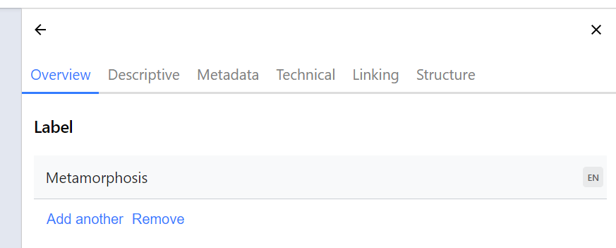
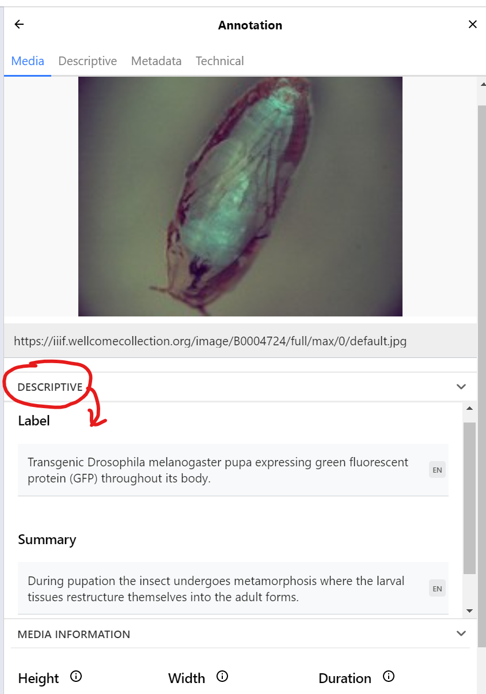
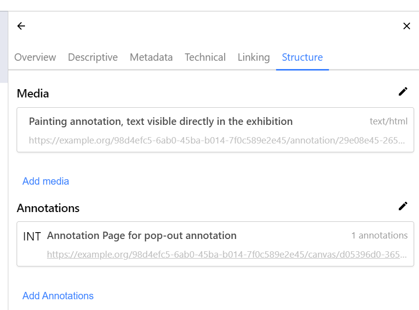
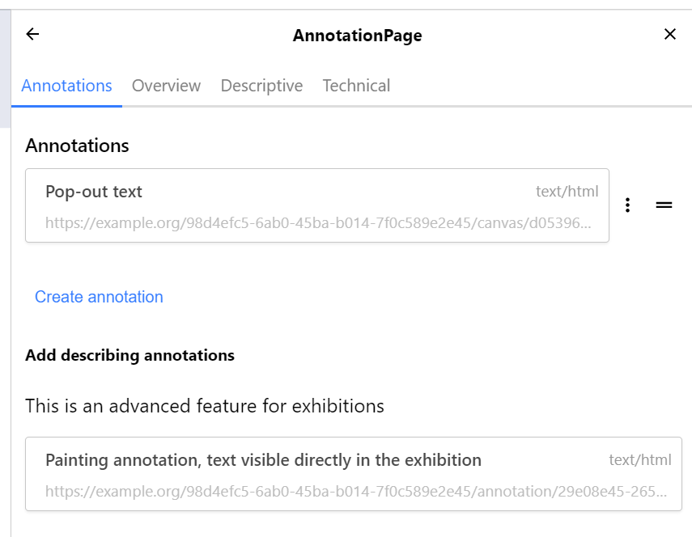
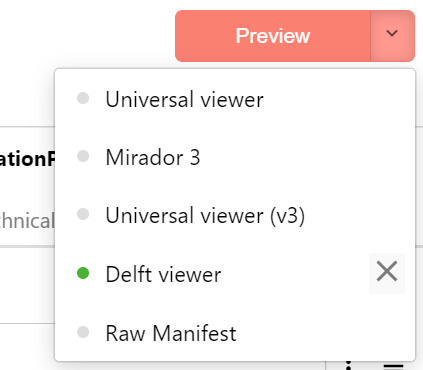
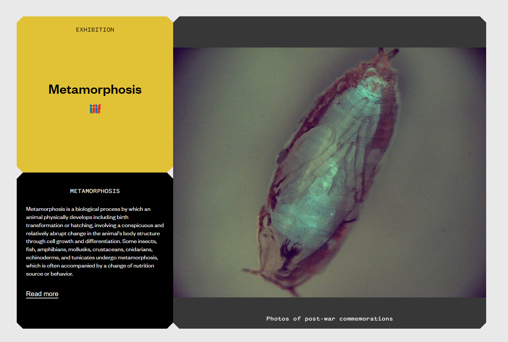
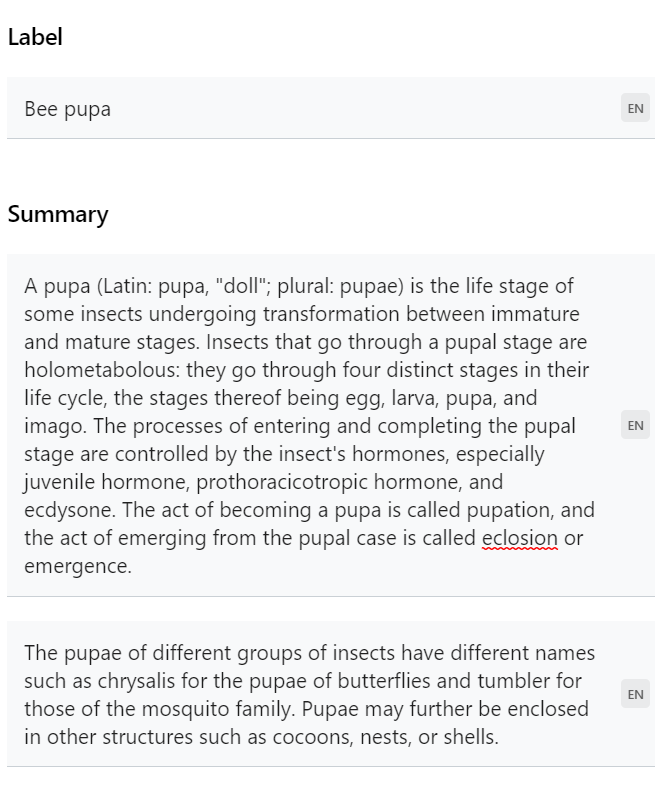
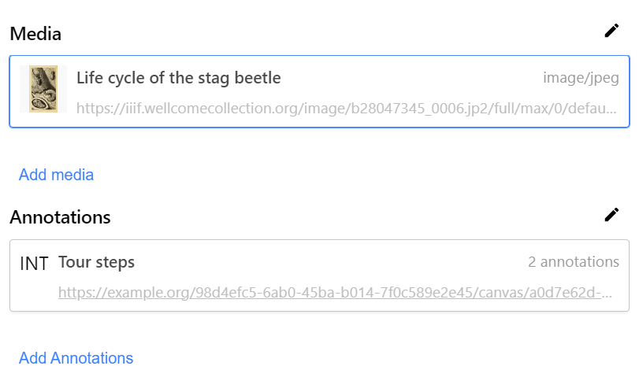

# Delft Exhibition Example

This exercise introduces the _Delft exhibition model._

Some existing examples:

 - [Novices](https://heritage.tudelft.nl/en/exhibitions/novieten)
 - [Corono Chronicles](https://heritage.tudelft.nl/en/exhibitions/corona-chronicles)
 - [Irrigation knowledge](https://heritage.tudelft.nl/en/exhibitions/irrigation-knowledge)

All of these examples show a set of common panel components, that can be used in various combinations, at different sizes, to build custom online exhibitions. These panels include:

 - Single image panels that pop out to a deep zoom viewer
 - Multi-image "collage" panels that pop out to a deep zoom viewer
 - Panels that pop out to launch a multi-step tour around a single image, or a collage of images, with different text for each step
 - Information panels that only contain text - and have longer text available as a pop-out
 - Panels that combine explanatory text with interactive elements
 - Video, 3D and 360-degree multimedia

And all of these can appear at different sizes and orientations relative to the other panels. The resulting layout is intended to echo the modular exhibition system used at TU Delft Library for physical exhibitions:

 - [Some background (2019 Medium article)](https://medium.com/digirati-ch/reaching-into-collections-to-tell-stories-3dc32a1772af)

In their online form, each exhibition is a web page - and that web page is driven by a single data file that carries all the information required to render the exhibition - the images, text, and other content.

This data file is a [IIIF Manifest](https://iiif.io/api/presentation/3.0/). Commonly, IIIF Manifests represent books, manuscripts, maps, paintings and other _digital objects_, and the IIIF manifest is loaded by a multipurpose IIIF Viewer (like the [Universal Viewer](https://universalviewer.io), or [Mirador](https://projectmirador.org)), which renders the digital object as a sequence of one or more views (e.g., allowing you to read through the pages of a book).

For Delft, the digital object that the Manifest represents is a Delft online exhibition, and the "viewer" is a bespoke web application that turns the information in the Manifest into the interactive exhibition on a single long form web page. You can still load these Delft exhibition manifests into a normal viewer and access the content, but won't get the specialised layout of the Delft exhibition.

## Why IIIF?

We could use a custom format to drive the Delft exhibitions (a custom JSON schema), and build a custom editing tool to assemble this custom format. But this would get very expensive to maintain. For organisations like Delft, much of the content of exhibitions already exists in IIIF form. If one panel is a painting, another panel is some pages from a book - these may already exist as IIIF Manifests, and we can import parts of those Manifests into our exhibition manifest.

We can use a IIIF Manifest Editor such as the Digirati Manifest Editor to build the Manifests that drive the exhibitions - this is a _general purpose tool_ for building IIIF Manifests visually.

Encoding the exhibitions in IIIF form is also good for archiving - for preserving the exhibition for future reference, and for re-use of its content. IIIF is an open standard designed for interoperability of content; exhibitions in a bespoke JSON format are much more likely to be forgotten and very unlikely to be reused.

## Modelling challenges

A Delft exhibition is more complex than a typical IIIF Manifest, in that there are specific layout requirements that a generic viewer would not be aware of (and unlikely to be able to render). The Delft exhibitions have  constructions like multi-step tours and info panels, and they have layout instructions that control the size of each panel. The IIIF model, when combined with W3C Web Annotations, gives us lots of flexibility in building up the structure of the Manifest. But for rendering the exhibition in the bespoke Delft "viewer", we have to follow a very specific structure in the IIIF - we need to control the _layout_ in the exhibition through the structure we build in the Manifest. Usually, we leave it to the IIIF Viewer (the UV, Mirador and so on) to decide on layout, but for Delft we want to control this layout precisely in the IIIF we create. It's OK for every other viewer to render this IIIF Manifest in its own way, but we need it to render in a very particular way when viewed _as a Delft exhibition_.

The IIIF Model gives us various components - like Lego bricks - that we can interpret as having a very specific intent when rendered _in the Delft exhibition._ This means that when using a general purpose tool like a IIIF Manifest Editor, we can't just pick any component we feel like to carry the content; we need to assemble it in exactly the way the Delft exhibition web application needs, to get the exact layout we want. This means we have to understand what the various IIIF components of a Delft exhibition do.

This exercise introduces the components to build a simple exhibition. It's not necessarily more complex than building any other IIIF Manifest with complex annotation content - it just needs to be done a particular way to work in the target environment.

Key concepts:

 - One exhibition is one Manifest - to build an exhibition like _Novices_, you create a single IIIF Manifest.
 - Each panel in the exhibition is an individual [IIIF Canvas](https://iiif.io/api/presentation/3.0/#53-canvas) within the single IIIF Manifest.
 - The exhibition renderer looks for custom [behavior](https://iiif.io/api/presentation/3.0/#behavior) properties to give information about size, orientation, and whether a panel is a text-only info panel.
 - Canvases can have multiple images on them, making a collage. In IIIF, the media is placed on the Canvas using a [painting annotation](https://iiif.io/api/presentation/3.0/#57-content-resources) (that is, an annotation with the `motivation` value of `painting`). In the Digirati Manifest Editor, media on the Canvas is listed on the **Structure** tab under the heading **Media**.
 - Individual painting annotations (media) can have `label` and `summary` values, which will be used (if present) by the exhibition. Many IIIF viewers would ignore those properties on a painting annotation.
 - Tour steps are constructed as a sequence of annotations with the `motivation` value of `describing`. All non-media annotations are listed on the **Structure** tab of the Canvas, under the heading **Annotations**.
 - A tour step can either _target_ (i.e., point at) one of the painting annotations (media) on the same Canvas, or it can target a _region_ of the Canvas. If the former, the exhibition will get the text for the tour step from that media - from the painting annotation's `label` and `summary` properties. If the latter, you need to provide an HTML body for the annotation (examples later).

## Building an example exhibition

For this exercise we will use some digitised material from Wellcome as sources.

First, open the [Manifest Editor](https://deploy-preview-239--manifest-editor-testing.netlify.app/). If you have previously used it, it may open on your last edited Manifest. 
Click the Manifest Editor logo in the top l;eft to get to the home screen, then click *Create Empty Manifest*. The Manifest Editor switched to editing a new Manifest.

You'll see the (as yet empty) Canvas List on the left. This contains a shortcut to "Edit Manifest" - that is, edit the properties of the Manifest itself.

In the right-hand panel, change the title of this new Manifest to "Metamorphosis", by editing its `label` property:



## Canvas 1: Simple Deep Zoom Image

Now create the first Canvas. Click "Add Canvas" on the left hand panel and pick "Add an annotation from an image service" in the list of shortcuts that appears on the right.

Paste the following image service URl into the text box:

```
https://iiif.wellcomecollection.org/image/B0004724
```

This will create the canvas, and **fill it with a `painting` annotation** - you should see the pupa in the central panel.

Give the canvas the following label:

```
Transgenic Drosophila melanogaster pupa
```

> **⚠** We would also like to create a thumbnail automatically at this point

Now we add a couple of features that turn this into a Delft exhibition panel.

In the **Technical** tab on the left, add two `behavior` values: `w-8` and `h-8`. These will control this panel's layout in the exhibition. As they are _custom_ behaviors they don't exist in the **Built-in behaviors** section, so you'll need to add them manually with **Add new value**:


Although we have already given the canvas a label, we need a slightly richer description for when the user pops open this panel to look more closely at the image. This is done by setting `label` and `summary` properties on the `painting` annotation we created earlier.
While this is valid IIIF, it's not a common construction, so you'll need to click on the painting annotation itself - i.e., the first image entry under **Media** on the Canvas **Overview** tab. This allows you to add properties to the painting annotation.

Open up the **Descriptive** section and add the values:

#### label

```
Transgenic Drosophila melanogaster pupa expressing green fluorescent protein (GFP) throughout its body.
```
#### summary

```
During pupation the insect undergoes metamorphosis where the larval tissues restructure themselves into the adult forms.
```



If you now go back to the Overview (by pressing the back arrow at the head of the Right Hand panel) you'll see that the default label "Image with Image Service" has been replaced by the label you just gave it.
The benefits of this approach will become apparent later when you start having multiple painting annotations on the same Canvas - where there are multiple images under **Media**.

## Canvas 2: Text-only panel

Now we will add a text panel, to serve as an introduction.

In the left hand Canvas list, you'll now see the first Canvas with its label. Click **Add Canvas** and this time click **HTML Annotation** from the list of templates.

Paste the following HTML into the **HTML Content** field and click "Create":

```html
<h2>Metamorphosis</h2>

<p>Metamorphosis is a biological process by which an animal physically develops including birth transformation or hatching, involving a conspicuous and relatively abrupt change in the animal's body structure through cell growth and differentiation. Some insects, fish, amphibians, mollusks, crustaceans, cnidarians, echinoderms, and tunicates undergo metamorphosis, which is often accompanied by a change of nutrition source or behavior.</p>
```

Give the canvas a height and width of 1000 on the Technical tab (these are the default values and will probably be already set).

The exhibition viewer doesn't use the `label` for an info Canvas, so just set it to something like `(info panel)` for convenience (the label is useful for identifying the canvas in the editor).

Now we need some custom behaviors to inform the Delft exhibition what this panel is. These are:

```
info
w-4
h-4
```


The last thing is to set the longer text that appears when the user clicks "Read more" on this panel in the exhibition. This text is not visible initially, and is carried as a descriptive annotation on the canvas (NOT a painting annotation like the one we have just made).

In the **Structure** tab on the right hand side, you can see an alternative view of the Canvas content. Under the **Media** heading is the `painting` annotation you already made, that will draw the text directly on the canvas.

Underneath this is the **Annotation** section that lets us edit the `annotations` property of the Canvas. In IIIF, we organise annotations into **Annotation Pages** - so we need to create one of these before we can add our text. Click **Add annotations** and then **Create** to create an annotation page.

Just underneath the message saying "No annotations", click **Create annotation**.

The action now switches to the canvas itself. This is because usually, you would be drawing a box on part of the Canvas to describe a particular region, but for this info panel we want to target the entire canvas. To do this we will make a normal annotation and then update its `target` to reference the entire canvas.

The Canvas (centre panel) will now be annotation mode, and you can draw a box. Draw the box anywhere. Once you have drawn the box the right hand panel offers some templates to base the annotation on. Choose _HTML Annotation_, which brings up a field you can paste the annotation content into:

```html
<h2>Metamorphosis and insects</h2>

<p>Animals can be divided into species that undergo complete metamorphosis ("holometaboly"), incomplete metamorphosis ("hemimetaboly"), or no metamorphosis ("ametaboly").</p>
<p>While ametabolous insects show very little difference between larval and adult forms (also known as "direct development"), both hemimetabolous and holometabolous insects have significant morphological and behavioral differences between larval and adult forms, the most significant being the inclusion, in holometabolus organisms, of a pupal or resting stage between the larval and adult forms.</p>

<h3>Development and terminology</h3>

<p>In a complete (holometabolous) metamorphosis the insect passes through four distinct phases, which produce an adult that does not resemble the larva. In an incomplete (hemimetabolous) metamorphosis an insect does not go through a full transformation, but instead transitions from a nymph to an adult by molting its exoskeleton as it grows.</p>
<p>In hemimetabolous insects, immature stages are called nymphs. Development proceeds in repeated stages of growth and ecdysis (moulting); these stages are called instars. The juvenile forms closely resemble adults, but are smaller and lack adult features such as wings and genitalia. The size and morphological differences between nymphs in different instars are small, often just differences in body proportions and the number of segments; in later instars, external wing buds form. The period from one molt to the next is called a stadium.</p>
<p>In holometabolous insects, immature stages are called larvae and differ markedly from adults. Insects which undergo holometabolism pass through a larval stage, then enter an inactive state called pupa (called a "chrysalis" in butterfly species), and finally emerge as adults.</p>

<h3>Evolution</h3>
<p>The earliest insect forms showed direct development (ametabolism), and the evolution of metamorphosis in insects is thought to have fuelled their dramatic radiation (1,2). Some early ametabolous "true insects" are still present today, such as bristletails and silverfish. Hemimetabolous insects include cockroaches, grasshoppers, dragonflies, and true bugs. Phylogenetically, all insects in the Pterygota undergo a marked change in form, texture and physical appearance from immature stage to adult. These insects either have hemimetabolous development, and undergo an incomplete or partial metamorphosis, or holometabolous development, which undergo a complete metamorphosis, including a pupal or resting stage between the larval and adult forms.</p>
```

Now click _Create_ under the HTML box to create this annotation. On the new annotation's **Technical** tab, set the `motivation` property to "describing" (if it isn't already).

You can set the `label` property of the annotation, and the `label` of the annotation page you created to hold it, which makes things easier to identify in the Manifest Editor even though they are not used in the exhibition. 

<!-- This has been fixed. There is a new "Target" tab on non-media annotations where you can change the target
> **⚠ NOT POSSIBLE**
> 
> Here we would reset the annotation target to the whole canvas - but the `target` UI is missing.
-->

This info Canvas now has the following content:



 - In the **Media** list, a single `painting` annotation with a textual body. 
 - In the **Annotations** list, a single _internal_ annotation page, and this annotation page comprises a single annotation - the 

The INT (_internal_) designation indicates that the annotations within this annotation page are included within the manifest; it's not a link to an external page of annotations (which you would not be able to edit in the Manifest Editor).

Navigating into this annotation page shows the annotation we just made (here given the `label` "Pop-out text"). Later on, we will add multiple annotations here.

You can also see a section called "Add describing annotations", with the same `painting` annotation seen in the Media tab. This is a special piece of functionality that allows you to create a `describing` annotation that points at a `painting` annotation. This is not something you would typically encounter in a IIIF Manifest, but is used to more easily turn collages (canvases with multiple images on them) into guided tours. Don't click this for now, we will use it later on another canvas.



The Information Panel Canvas is now complete.

You should save your work. If the Manifest Editor is configured with a storage provider, you can save to that - otherwise (the default), simply export the Manifest (from the File menu), downloading it to your computer.

<!-- Export has been fixed, with a new screen. No stubs, and fixed HTML encoding. 
> **⚠ EXPORT NOT WORKING** 
> 
> Export is stubs, not a fully expanded manifest
-->

You can now also preview the exhibition, if the Manifest Editor is configured with Delft preview as a target:



This launches the current Manifest in a new window, with the panels you have made so far (just two, plus the automatic yellow panel derived from the manifest title).



You can see that:

 - The canvas label is displayed for the large image
 - clicking the large image shows the painting annotation label and summary
 - The info panel `painting` annotation (media) appears directly on the panel
 - The info panel `describing` annotation is revealed by clicking "Read more" *

> **⚠ PROBLEMS WITH PREVIEW** 
> - *Read More link doesn't work on info panel
> - Hard-coded labels on canvases and tour, rather than from content
> - (e.g., "Photos of post-war commemorations" as canvas label, "FEMALE VOICES IN SPEECH RECOGNITION TECHNOLOGY" on tour step)
> - These strings are not present in the manifest being previewed.

## Canvas 3: Combo summary panel

The next example of an exhibition panel acts like a combination of the previous two panels. There's room for longer text alongside the main feature, and this text can be to the left, right, above or below. One difference from the previous info panel is that it doesn't support pop-out text that appears in a full page overlay.

In the Canvas List on the left, click **Add Canvas**. Pick **Image Service** from the templates as with the first Canvas, using this image service:

```
https://iiif.wellcomecollection.org/image/B0009275
```

Give this Canvas `label` and `summary` properties. Rather than using HTML, for this kind of info panel, we just supply our paragraphs as separate string values:

#### label

```
Bee Pupa
```

#### summary

```
A pupa (Latin: pupa, "doll"; plural: pupae) is the life stage of some insects undergoing transformation between immature and mature stages. Insects that go through a pupal stage are holometabolous: they go through four distinct stages in their life cycle, the stages thereof being egg, larva, pupa, and imago. The processes of entering and completing the pupal stage are controlled by the insect's hormones, especially juvenile hormone, prothoracicotropic hormone, and ecdysone. The act of becoming a pupa is called pupation, and the act of emerging from the pupal case is called eclosion or emergence.

The pupae of different groups of insects have different names such as chrysalis for the pupae of butterflies and tumbler for those of the mosquito family. Pupae may further be enclosed in other structures such as cocoons, nests, or shells.
```

Supplying the summary as two separate values looks like this:



This panel occupies the full 12 unit width of our grid, even though the picture is squarer than that - we are allowing for the text panel making it wider. On the **Technical** tab, give the Canvas the following `behavior` values:

```
right
w-12
h-6
```

The `right` behavior identifies the type of panel and the text location.

This kind of layout also uses the `requiredStatement` property to provide a credit note. This is also on the **Descriptive** tab. Add a Required statement, setting the `label` of the required statement blank and giving the value:

```
Newcastle EM Research Service, Newcastle University
```

As with the first Canvas, we are going to give a `label` and `summary` to the painting annotation itself, to display when the user launches into a large view of the image. Scroll down on the **Overview** and select the single entry under **Media** - this should be the bee pupa `painting` annotation (you can also access this from the **Structure** tab).

#### label

```
The life cycle of the bee goes through 4 stages: egg, larva, pupa, adult.
```

#### summary

```
This image is a false-coloured SEM of a bee pupa just before the sixth and final moult (shedding of its outer skin). At the end of the pupa stage, the bee emerges as an adult having completed its transformation (metamorphosis). The bee is 8 mm in size.
```

If you now preview the exhibition you'll see the new type of panel - with the Canvas label and summary used to populate the text on the right, and the painting annotation label and summary providing the information about the image when clicked on.

<!-- Delft Viewer Preview is just a visual guide at the moment, not fully functional -->
> **⚠ PROBLEMS WITH PREVIEW** 
> - Same as above - hard-coded painting annotation label and summary


## Canvas 4: A two-step tour on one image

We'll make another one of these two-part canvases for the next panel, with the text on the left this time. But we'll make a more complex _tour_ from this single image.

As before, in the Canvas List on the left, click **Add Canvas**. Pick **Image Service** from the templates, and use:

```
https://iiif.wellcomecollection.org/image/b28047345_0006.jp2
```

Give this Canvas `label` and `summary` properties. Again, supply the `summary` as two _separate_ values.

#### label

```
The metamorphosis of the stag beetle
```

#### summary

```
A well-known species in much of Europe is Lucanus cervus, referred to in some European countries (including the United Kingdom) as the stag beetle; it is the largest terrestrial insect in Europe. Pliny the Elder noted that Nigidius called the beetle lucanus after the Italian region of Lucania where they were used as amulets. The scientific name of Lucanus cervus adds cervus, deer.

The larvae feed for several years on rotting wood, growing through three larval stages until eventually pupating inside a pupal cell constructed from surrounding wood pieces and soil particles. In the final larval stage, "L3", the surviving grubs of larger species, such as Prosopocoilus giraffa, may be the size of a human finger.
```

This panel again occupies the full 12 unit width of our grid. Use the following `behavior` values:

```
left
w-12
h-10
```

<!-- Unable to find the cause of this - I _think_ it happens when you have 2 that have the same value -->
> **⚠ Problem** 
> - For some reason on this Canvas had real problems with the behavior input field losing focus after every keystroke.

Again, supply a `requiredStatement` property to provide a credit note. This is also on the **Descriptive** tab. Add a Required statement, setting the `label` of the required statement blank and giving the value:

```
Image from The transformations (or metamorphoses) of insects; Duncan, P. Martin (Peter Martin), 1821-1891
```

As with the first Canvas, we are going to give a `label` and `summary` to the painting annotation itself, to display when the user launches into a large view of the image. Scroll down on the **Overview** and select the single entry under **Media** - this should be the bee pupa `painting` annotation (you can also access this from the **Structure** tab).

#### label

```
Life cycle of the stag beetle
```

#### summary

```
Like all beetles, stag beetles have "complete" metamorphosis with egg, larval, pupal, and adult stages.  In many stag beetle species, females lay their eggs on or under the bark of dead, fallen trees.  Upon hatching, larvae chew their way into the tree and feed on the juices of the decaying wood.
```

If you now preview the exhibition you'll see that this is just like a flipped version of the previous Canvas.

> **⚠ PROBLEMS WITH PREVIEW** 
> - Can't get preview to update - even raw manifest!

Now we are going to introduce _tour steps_.

Our first tour step will be the whole image, and the second will zoom in on the bottom-left of the image.

On the **Structure** tab, in the **Annotations** section, click "Add Annotations". There is no existing Annotation Page on this Canvas, so we'll need to click **Create** at the next step to make one to hold the tour step annotations.

This is where the "advanced feature for exhibitions" comes in - it allows us to create an annotation for a tour step that simply points at (targets) an existing `painting` annotation and reuses its content.

Click the painting annotation - the Manifest Editor creates a describing annotation from this and removes the painting annotation from the list of candidates.

Now create another annotation by clicking **Create annotation**.

This shifts focus to the Canvas. Draw a box around the pupa in the bottom left.

> **⚠ This needs more visual feedback** 
> - cursor change?
> - some other indicator?

Once you have created a box selection the right panel shows a choice of Annotation templates. Pick **HTML Annotation**.

Supply the following content

```
<h2>From pupa to larva</h2>

<p>After 6 years, the larva leaves the wood and makes a ‘cocoon’ in the soil. Next it turns into a pupa. This happens in late summer or autumn and lasts a few weeks. Then the pupa turns into a fully grown beetle which stays under the ground until the next summer when it comes out as an adult.</p>
```


It's not necessary for the exhibition, but may be convenient now to rename the _Annotation Page_ created earlier to "Tour steps" or similar:



<!-- This should now be fixed too, in addition to them disappearing
> **⚠ The describing annotation target "sticks"** 
> - After creating the describing anno, the target stays drawn on other canvases.
-->


> **⚠ PROBLEMS WITH PREVIEW** 
> - These tour steps do not show up on the preview.

## Canvas 5: A tour of a collage

(use the LAST example on Novieten)

(use the iiif explorer to find the canvas pages)

## Canvas 6: Another info panel

## Canvas 7: Another info panel (to balance)

## Canvas 8: Another collage tour, this time with regions

Use the iiif-explorer to pick whole image AND crops

Make some tour steps that point to images and some that point to regions (good overlaps)

re-order the tour steps.

## Canvas 9: vertical text panels

(you can even become a professor)

## Canvas 10: A tour with ONLY regional annotations - around a single image

## Canvas 11: A video on YouTube

## Canvas 12: A video, as a text-combo, with a specific start point


